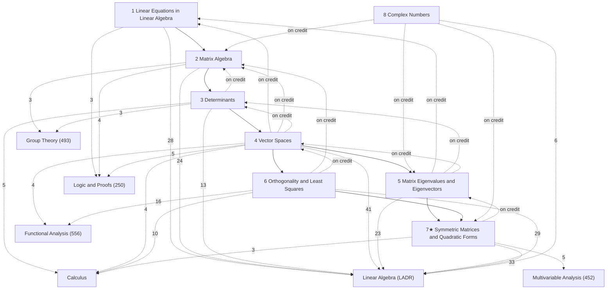

# Applied Linear Algebra

Matrix linear algebra — linear systems, matrix algebra, determinants, vector spaces, eigenvalues, orthogonality and least squares — following David C. Lay, Steven R. Lay and Judi J. McDonald, *Linear Algebra and Its Applications*, 5th edition (Pearson, 2016), section by section: §1–§52 are Lay's Sections 1.1–7.5 in order (each note's alias gives the Lay number, e.g. "Lay 2.8"), and §53 is his Appendix B (complex numbers; Appendix A's proof is in §2). The course, MATH 235 at UMass Amherst (Alexei Oblomkov), used the 6th edition; its handwritten lecture notes L1–L22 supply examples (*Source: 235 lecture …*). Chapter 7 (★) was not part of the course and is included as its continuation.

These are the computational notes: every definition and result Lay states, every proof he gives, his algorithms, and a lean selection of worked examples. The proof-based, operator-theoretic treatment of the same material is [[Linear Algebra]] (Axler, *Linear Algebra Done Right*); the main items here carry a folded *Connections* callout pointing to it.

## How the chapters build on each other
Solid arrows: a chapter's proofs and examples rely on the earlier chapter (arrows implied by others are omitted; exact counts are in each chapter note). Dashed arrows labelled "on credit": results used before they are proved. Dashed arrows to the Math subjects: where the rigorous treatment is, labelled with the number of *Connections* links (only arrows with 3 or more are drawn).

## Chapters
- [[· 1 Linear Equations in Linear Algebra]]
- [[· 2 Matrix Algebra]]
- [[· 3 Determinants]]
- [[· 4 Vector Spaces]]
- [[· 5 Matrix Eigenvalues and Eigenvectors]]
- [[· 6 Orthogonality and Least Squares]]
- [[· 7★ Symmetric Matrices and Quadratic Forms]]
- [[· 8 Complex Numbers]]

## Central results
- [[Uniqueness of the Reduced Echelon Form]] (§2.1)
- [[Existence and Uniqueness Theorem for Linear Systems]] (§2.3)
- [[The Invertible Matrix Theorem]] (§13.1)
- [[Cofactor Expansion]] (§20.1)
- [[Multiplicative Property of the Determinant]] (§21.9)
- [[Cramer's Rule]] (§22.1)
- [[Determinants as Area or Volume]] (§22.4)
- [[The Coordinate Mapping Is an Isomorphism]] (§26.3)
- [[The Basis Theorem]] (§27.5)
- [[The Change-of-Coordinates Matrix]] (§29.1)
- [[Convergence of Regular Markov Chains]] (§31.3)
- [[Eigenvalues Are the Roots of the Characteristic Equation]] (§33.4)
- [[The Diagonalization Theorem]] (§34.1)
- [[The Fundamental Subspaces Are Orthogonal Complements]] (§40.6)
- [[The Best Approximation Theorem]] (§42.3)
- [[The QR Factorization]] (§43.3)
- [[Least Squares via the Normal Equations]] (§44.1)
- [[The Principal Axes Theorem]] (§49.2)

## Course record (MATH 235)
The instructor's lectures in the course folder, and where they are in these notes:

| Lectures | Topics | Notes |
|---|---|---|
| L1, L02, L2, L3, Feb-18, L5 | row reduction, geometry of linear systems, linear combinations, linear dependence, linear transformations | §1–§9 |
| L6–L9 | matrix multiplication, powers, inverses | §11–§13 |
| L10, L14–L17 | subspaces, Nul A, coordinates, rank, change of coordinates | §18–§19, §23–§29 |
| L11–L13 | determinants, row reduction, Cramer's rule | §20–§22 |
| L18–L21 | eigenvalues (Fibonacci), diagonalization, multiplicities, complex eigenvalues | §30, §32–§36 |
| L22 | inner products | §40 |

Exams: three (20%, 20%, 25%); online homework and quizzes on MyMathLab (35%). The instructor's section checklist covers Chapters 2–4.

## Rigorous treatment
Number of *Connections* links from these notes to each Math subject: [[Linear Algebra]] (197), [[Calculus]] (25), [[Functional Analysis]] (20), [[Logic and Proofs]] (12), [[Group Theory]] (8), [[Multivariable Analysis]] (8).
