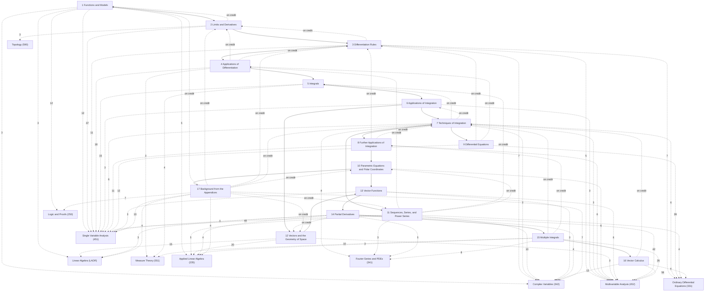

# Calculus

Single-variable and multivariable calculus, following James Stewart, Daniel Clegg and Saleem Watson, *Calculus: Early Transcendentals*, 9th edition (Cengage, 2021), section by section: §1–§137 are Stewart's Sections 1.1–16.9 in order (each note's alias gives the Stewart number, e.g. "Stewart 2.5"), and §139–§144 are his Appendices A–E and G (the proofs of Appendix F are written out in the sections of the theorems they prove). Chapters 12–16 are MATH 233 (UMass Amherst, Spring 2023, Maria Nikolaou); its practice exams and reviews supply worked examples (*Source: 233 …*).

These are the computational notes: every definition and result Stewart states, every proof he gives, his methods, and a lean selection of worked examples. The rigorous theory lives in the Math subjects — limits, continuity, derivatives, the integral and series in [[Single Variable Analysis]], several variables and vector calculus in [[Multivariable Analysis]], vectors and determinants in [[Linear Algebra]] — and the main items here carry a folded *Connections* callout pointing to their rigorous treatment.

## How the chapters build on each other
Solid arrows: a chapter's proofs and examples rely on the earlier chapter (arrows implied by others are omitted; exact counts are in each chapter note). Dashed arrows labelled "on credit": results used before they are proved. Dashed arrows to the Math subjects: where the rigorous treatment is, labelled with the number of *Connections* links (only arrows with 3 or more are drawn).

## Chapters
- [[· 1 Functions and Models]]
- [[· 2 Limits and Derivatives]]
- [[· 3 Differentiation Rules]]
- [[· 4 Applications of Differentiation]]
- [[· 5 Integrals]]
- [[· 6 Applications of Integration]]
- [[· 7 Techniques of Integration]]
- [[· 8 Further Applications of Integration]]
- [[· 9 Differential Equations]]
- [[· 10 Parametric Equations and Polar Coordinates]]
- [[· 11 Sequences, Series, and Power Series]]
- [[· 12 Vectors and the Geometry of Space]]
- [[· 13 Vector Functions]]
- [[· 14 Partial Derivatives]]
- [[· 15 Multiple Integrals]]
- [[· 16 Vector Calculus]]
- [[· 17 Background from the Appendices]]

## Central results
- [[Limit Laws]] (§8.1)
- [[Product Rule]] (§15.1)
- [[Quotient Rule]] (§15.2)
- [[Chain Rule]] (§17.2)
- [[Derivative of an Inverse Function]] (§19.1)
- [[Fermat's Theorem on Local Extrema]] (§25.2)
- [[Rolle's Theorem]] (§26.1)
- [[L'Hospital's Rule]] (§28.2)
- [[Substitution Rule]] (§38.1)
- [[Integration by Parts]] (§44.1)
- [[Arc Length Formula]] (§52.1)
- [[Test for Divergence]] (§70.5)
- [[Integral Test]] (§71.1)
- [[Direct Comparison Test]] (§72.1)
- [[Alternating Series Test]] (§73.1)
- [[Ratio Test]] (§74.1)
- [[Taylor's Inequality]] (§78.4)
- [[Fundamental Theorem for Line Integrals]] (§109.1)
- [[Test for Conservative Fields]] (§110.5)

## Course record (MATH 233)
| Exam | Coverage | Notes |
|---|---|---|
| Exam 1 (March 29, 2023) | Stewart 12.1–12.6, 13.1–13.4, 14.1–14.6 | §93–§111 |
| Exam 2 (April 25, 2023) | 14.7, 14.8, 15.1–15.8 | §113–§123 |
| Final (May 23, 2023) | cumulative, emphasis on Chapter 16 | §93–§137 |

Prerequisite: MATH 132 (Calculus II); Chapters 1–11 are included as the single-variable foundation.

## Rigorous treatment
Number of *Connections* links from these notes to each Math subject: [[Single Variable Analysis]] (203), [[Multivariable Analysis]] (163), [[Ordinary Differential Equations]] (63), [[Complex Variables]] (52), [[Applied Linear Algebra]] (43), [[Linear Algebra]] (28), [[Fourier Series and PDEs]] (28), [[Measure Theory]] (20), [[Logic and Proofs]] (19), [[Topology]] (7), [[Differentiable Manifolds]] (2).
