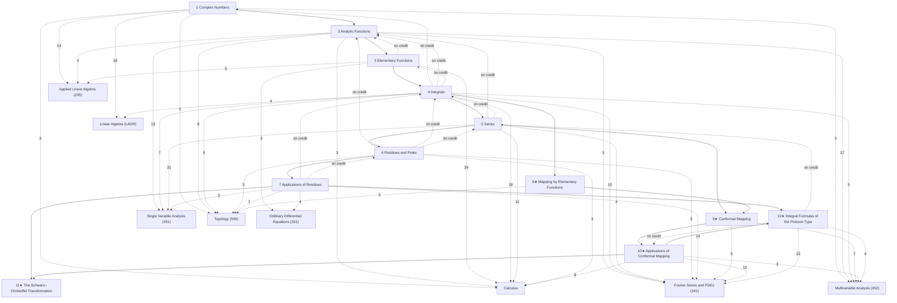

# Complex Variables

Complex numbers, analytic functions, contour integration, Cauchy's theorem and integral formula, Taylor and Laurent series, residues and their applications, and conformal mapping with its applications to steady temperatures, electrostatics and fluid flow — following James W. Brown and Ruel V. Churchill, *Complex Variables and Applications*, 9th edition (McGraw-Hill, 2014), section by section through all 140 sections; note §N is Brown–Churchill's Section N (alias "B&C N"). The course, MAT 342 at Stony Brook (Olga Plamenevskaya, Fall 2024), covered Chapters 1–7 with some sections optional; those and Chapters 8–12 are included and marked ★.

This is the vault's home for complex analysis: every proof Brown and Churchill give is written out (Cauchy–Goursat, the Cauchy integral formula and its extension, Liouville, the maximum modulus principle, Taylor's and Laurent's theorems, the residue theorem, the argument principle, Rouché), with worked examples from the course homework and past finals. The real-variable tools are in [[Single Variable Analysis]] and [[Multivariable Analysis]]; the potential problems of Chapters 9–12 meet [[Fourier Series and PDEs]] (Chapter 4).

## How the chapters build on each other
Solid arrows: a chapter's proofs and examples rely on the earlier chapter (arrows implied by others are omitted; exact counts are in each chapter note). Dashed arrows labelled "on credit": results used before they are proved. Dashed arrows to the Math subjects: where the rigorous treatment is, labelled with the number of *Connections* links (only arrows with 3 or more are drawn).

## Chapters
- [[· 1 Complex Numbers]]
- [[· 2 Analytic Functions]]
- [[· 3 Elementary Functions]]
- [[· 4 Integrals]]
- [[· 5 Series]]
- [[· 6 Residues and Poles]]
- [[· 7 Applications of Residues]]
- [[· 8★ Mapping by Elementary Functions]]
- [[· 9★ Conformal Mapping]]
- [[· 10★ Applications of Conformal Mapping]]
- [[· 11★ The Schwarz–Christoffel Transformation]]
- [[· 12★ Integral Formulas of the Poisson Type]]

## Central results
- [[Cauchy–Riemann Equations]] (§21.1)
- [[Sufficient Conditions for Complex Differentiability]] (§23.1)
- [[Analytic Functions Have Harmonic Components]] (§27.1)
- [[Branches of the Complex Logarithm]] (§33.1)
- [[ML-Inequality]] (§47.2)
- [[Antiderivatives and Independence of Path (complex)]] (§49.1)
- [[Cauchy–Goursat Theorem]] (§51.3)
- [[Principle of Deformation of Paths]] (§53.2)
- [[Cauchy Integral Formula]] (§54.1)
- [[Cauchy Integral Formula for Derivatives]] (§56.1)
- [[Morera's Theorem]] (§57.3)
- [[Liouville's Theorem]] (§58.1)
- [[Fundamental Theorem of Algebra (Liouville proof)]] (§58.2)
- [[Maximum Modulus Principle]] (§59.3)
- [[Taylor's Theorem for Analytic Functions]] (§63.1)
- [[Laurent's Theorem]] (§67.1)
- [[Cauchy's Residue Theorem]] (§76.1)
- [[Residues at Poles]] (§80.1)
- [[Casorati–Weierstrass Theorem]] (§84.3)
- [[Jordan's Lemma]] (§88.2)
- [[Argument Principle]] (§93.4)
- [[Rouché's Theorem]] (§94.1)
- [[Bromwich Inversion Formula]] (§95.4)
- [[Linear Fractional Transformation Through Three Points]] (§100.1)
- [[Conformal Mappings Preserve Angles]] (§112.1)
- [[Harmonic Functions Under Conformal Maps]] (§116.1)
- [[Schwarz–Christoffel Transformation]] (§128.4)

## Course record (MAT 342, Fall 2024)
Twice-weekly lectures (no lecture notes in the course folder), weekly homework (15%), quizzes (15%), midterm on Chapters 1–5 (30%), final (40%) with a reference page attached.

| Weeks | Sections | Notes |
|---|---|---|
| 1–2 | complex numbers, roots, functions, limits, continuity | §1–§18 |
| 3–4 | derivatives, Cauchy–Riemann, analytic and elementary functions | §19–§38 |
| 5–8 | contour integrals, antiderivatives, Cauchy–Goursat, Cauchy integral formula, Liouville, maximum modulus | §41–§59 |
| 10–11 | Taylor and Laurent series | §60–§68 |
| 12–13 | residues, singular points, zeros and poles | §74–§84 |
| 14 | improper integrals by residues, argument principle, Rouché | §85–§87, §93–§94 |

Examples marked *Source: 342 …* come from the homework (most of it Brown–Churchill exercises) and past finals.

## Rigorous treatment
Number of *Connections* links from these notes to each other subject: [[Calculus]] (72), [[Fourier Series and PDEs]] (67), [[Single Variable Analysis]] (58), [[Multivariable Analysis]] (42), [[Topology]] (39), [[Applied Linear Algebra]] (23), [[Linear Algebra]] (21), [[Ordinary Differential Equations]] (10), [[Differentiable Manifolds]] (2), [[Logic and Proofs]] (1), [[Functional Analysis]] (1), [[Group Theory]] (1).
