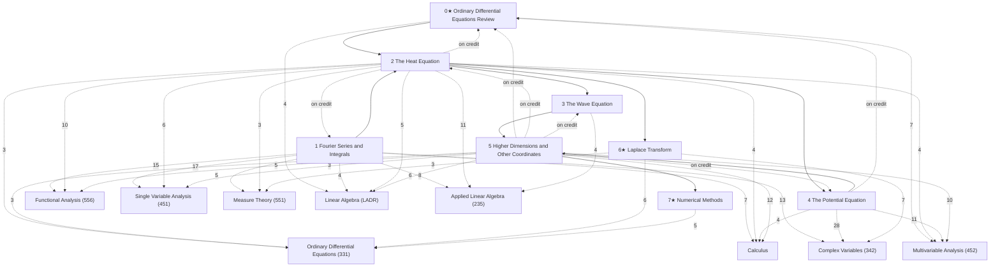

# Fourier Series and PDEs

Fourier series and the classical partial differential equations — the heat equation, the wave equation and the potential (Laplace) equation, solved by separation of variables, eigenfunction expansions, Fourier integrals and transforms — following David L. Powers, *Boundary Value Problems and Partial Differential Equations*, 5th edition (Elsevier Academic Press, 2006), section by section through all of Chapters 0–7 (each note's alias gives the Powers section, e.g. "Powers 2.3"). The course, MAT 341 at Stony Brook (Qi Yao, Fall 2024), used the 6th edition and covered 1.1–1.5, 1.9, 2.1–2.10, 3.1–3.4, 4.1–4.5 and 5.2–5.3, and its lectures also solved the infinite rod, 2.11 (lectures 10.22 and 10.24, HW 9, Midterm 2), which is therefore not starred. Everything else is included because it underlies the physics subjects, and is marked ★ (whole chapters 0, 6 and 7 among it). A starred section can still have been touched on in a lecture (0.1, 1.6, 1.10) or supply course problems as worked examples (1.10, 2.12, 3.6, 6.2); its header records which.

These are computational notes: every definition and result Powers states, every proof he gives (including the proof of pointwise convergence of Fourier series, 1.7), the solution methods, and a lean selection of worked problems, many from the course's lectures, homework and exams. The Hilbert-space view of Fourier series is [[Functional Analysis]]; the convergence tools are in [[Single Variable Analysis]] and [[Measure Theory]]; the ODE background and the Laplace transform are in [[Ordinary Differential Equations]].

## How the chapters build on each other
Solid arrows: a chapter's proofs and examples rely on the earlier chapter (arrows implied by others are omitted; exact counts are in each chapter note). Dashed arrows labelled "on credit": results used before they are proved. Dashed arrows to the Math subjects: where the rigorous treatment is, labelled with the number of *Connections* links (only arrows with 3 or more are drawn).

## Chapters
- [[· 0★ Ordinary Differential Equations Review]]
- [[· 1 Fourier Series and Integrals]]
- [[· 2 The Heat Equation]]
- [[· 3 The Wave Equation]]
- [[· 4 The Potential Equation]]
- [[· 5 Higher Dimensions and Other Coordinates]]
- [[· 6★ Laplace Transform]]
- [[· 7★ Numerical Methods]]

## Central results
- [[Green's Function for Boundary Value Problems]] (§5.1)
- [[Convergence Theorem for Fourier Series]] (§8.1)
- [[Uniform Convergence of Fourier Series]] (§9.3)
- [[Parseval's Equality for Fourier Series]] (§11.4)
- [[Fourier Integral Theorem]] (§14.1)
- [[Solution of the Fixed-End Heat Problem]] (§19.5)
- [[Sturm–Liouville Orthogonality Theorem]] (§23.2)
- [[Convergence of Eigenfunction Expansions]] (§24.2)
- [[Heat Kernel Solution of the Infinite Rod]] (§27.3)
- [[Series Solution of the Vibrating String]] (§30.2)
- [[d'Alembert's Solution of the Wave Equation]] (§31.2)
- [[Laplacian in Polar Coordinates]] (§35.3)
- [[Dirichlet Problem in a Disk]] (§39.2)
- [[Poisson Integral Formula]] (§39.3)
- [[Mean Value Property of Harmonic Functions]] (§39.4)
- [[Maximum Principle for Laplace's Equation]] (§39.5)
- [[General Solution of Bessel's Equation]] (§45.5)
- [[Orthogonality of Legendre Polynomials]] (§49.5)
- [[Rodrigues' Formula]] (§49.6)
- [[Heaviside's Expansion Formula]] (§52.2)

## Course record (MAT 341, Fall 2024)
Two lectures a week (handwritten lecture notes, weeks 1–13; week 11 missing), weekly homework (30%), two midterms (20% each: 1.1–1.5, 2.1–2.3; and 2.4–2.10, 1.9, 3.1–3.4, with an infinite-rod problem from 2.11), final (30%, cumulative).

| Weeks | Sections | Notes |
|---|---|---|
| 1–3 | 1.1–1.5 Fourier series, 2.1 | §6–§10, §17 |
| 3–6 | 2.1–2.6 heat equation, 1.9 Fourier integral | §17–§22, §14 |
| 7–8 | 2.7–2.10 Sturm–Liouville, eigenfunction series, semi-infinite rod; 2.11 infinite rod | §23–§27 |
| 9–10 | 3.1–3.4 wave equation, d'Alembert | §29–§32 |
| 10–13 | 4.1–4.5 potential equation, 5.2–5.3 two-dimensional heat | §35–§39, §42–§43 |

Examples marked *Source: 341 …* come from the lectures, homework, midterms and practice problems.

## Rigorous treatment
Number of *Connections* links from these notes to each other subject: [[Complex Variables]] (49), [[Multivariable Analysis]] (36), [[Applied Linear Algebra]] (30), [[Functional Analysis]] (30), [[Calculus]] (29), [[Single Variable Analysis]] (29), [[Ordinary Differential Equations]] (21), [[Linear Algebra]] (20), [[Measure Theory]] (12).
