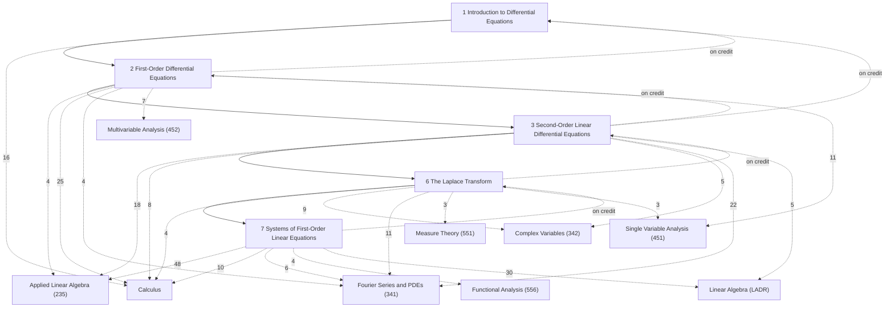

# Ordinary Differential Equations

Ordinary differential equations as solved in practice — first-order equations, second-order linear equations and vibrations, the Laplace transform, and linear systems — following William E. Boyce, Richard C. DiPrima and Douglas B. Meade, *Elementary Differential Equations and Boundary Value Problems*, 11th edition (Wiley, 2017), section by section, for the chapters the course taught: Chapters 1, 2, 3, 6 and 7 (BDP's chapter numbers are kept; each note's alias gives the BDP section, e.g. "BDP 2.5"). Sections of these chapters that MATH 331 skipped are included and marked ★ (2.9, 3.6, 6.6, 7.7–7.9). Chapters 4, 5 and 8–11 (higher-order equations, series solutions, numerical methods, nonlinear systems, PDEs and boundary value problems) are not included.

These are the computational notes: every definition and result BDP states, every proof BDP gives (including the Picard-iteration proof of the existence and uniqueness theorem, whose home in the vault is here), the solution methods, and a lean selection of worked examples, many from the course's written homework and exams. The linear algebra behind Chapter 7 lives in [[Applied Linear Algebra]] and [[Linear Algebra]]; the analysis behind the existence theory in [[Single Variable Analysis]]; the first-order material overlaps Stewart's treatment in [[Calculus]] (Chapter 9).

## How the chapters build on each other
Solid arrows: a chapter's proofs and examples rely on the earlier chapter (arrows implied by others are omitted; exact counts are in each chapter note). Dashed arrows labelled "on credit": results used before they are proved. Dashed arrows to the Math subjects: where the rigorous treatment is, labelled with the number of *Connections* links (only arrows with 3 or more are drawn).

## Chapters
- [[· 1 Introduction to Differential Equations]]
- [[· 2 First-Order Differential Equations]]
- [[· 3 Second-Order Linear Differential Equations]]
- [[· 6 The Laplace Transform]]
- [[· 7 Systems of First-Order Linear Equations]]

## Central results
- [[Integrating Factor Solution Formula]] (§4.2)
- [[Solution of Separable Equations]] (§5.1)
- [[Test for Exact Equations]] (§9.2)
- [[Picard–Lindelöf Theorem]] (§11.8)
- [[Principle of Superposition (linear ODEs)]] (§14.2)
- [[Wronskian Criterion for Fundamental Sets]] (§14.4)
- [[Abel's Theorem (Wronskian)]] (§14.8)
- [[Constant-Coefficient Second-Order Equations]] (§16.2)
- [[Method of Undetermined Coefficients]] (§17.4)
- [[Variation of Parameters Formula]] (§18.1)
- [[Laplace Transform of a Derivative]] (§22.1)
- [[Table of Elementary Laplace Transforms]] (§22.6)
- [[Second Shifting Theorem]] (§23.2)
- [[First Shifting Theorem]] (§23.3)
- [[Convolution Theorem for the Laplace Transform]] (§26.2)
- [[Existence and Uniqueness for Linear ODE Systems]] (§27.3)
- [[Eigenvector Solutions of Linear Systems]] (§31.2)
- [[Classification of 2×2 Linear Systems]] (§32.3)
- [[Matrix Exponential Solution]] (§33.4)

## Course record (MATH 331, Summer 2023)
Asynchronous video lectures (no lecture notes in the course folder). Grading: final 30%, midterm 30% (6/15, Sections 1.1–3.4), online homework (WileyPLUS) 25%, written homework 10%, participation 5%.

| Written homework | Sections | Notes |
|---|---|---|
| 1 | 1.1–2.2 | §1–§6 |
| 2 | 2.3–2.8 | §7–§14 |
| 3 | 3.1–3.4 | §17–§20 |
| 4 | 3.5–3.8 | §21, §23–§24 |
| 5 | Ch. 6 | §26–§30 |
| 6 | Ch. 7 | §33–§38 |

Examples marked *Source: 331 …* come from the written homework, the Summer 2023 midterm and earlier UMass exams (Spring 2020 midterm, Fall 2021 and Fall 2022 finals).

## Rigorous treatment
Number of *Connections* links from these notes to each other subject: [[Applied Linear Algebra]] (71), [[Calculus]] (63), [[Fourier Series and PDEs]] (43), [[Linear Algebra]] (36), [[Single Variable Analysis]] (19), [[Complex Variables]] (14), [[Multivariable Analysis]] (7), [[Functional Analysis]] (7), [[Measure Theory]] (3), [[Differentiable Manifolds]] (2), [[Topology]] (1).
