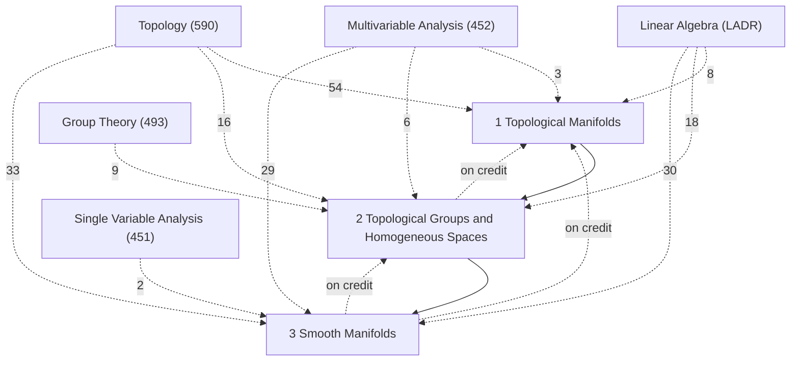

# Differentiable Manifolds

MATH 591, *Introduction to Differentiable Manifolds* (Fall 2026, Alejandro Uribe), a first-year PhD course; text Lee, *Introduction to Smooth Manifolds* (2nd ed.), reference Tu, *An Introduction to Manifolds*. Section numbers §1–§18 are the notes' own; every box ends with its counterpart in Lee (*Lee: …*), and [[Differentiable Manifolds Lee Concordance]] reads the two side by side. [[Differentiable Manifolds Course Log]] records the lectures and the homework. LaTeX source (still being extended during the term): `tex/math591_manifolds_notes.tex`.

## Roadmap
These notes follow the course, and the course builds manifolds in two ways that run as parallel threads. Along the *equations* thread, manifolds are cut out of Euclidean space as level sets: spheres, then $\mathrm{SL}(n,\mathbb{R})$, $\mathrm{O}(n)$, $\mathrm{U}(n)$. Along the *quotients* thread, they are glued together by identifying points: $\mathbb{CP}^n$, orbit spaces, coset spaces $G/H$, Grassmannians. Chapters 1 and 2 develop the two threads side by side, and in Chapter 3 they part ways over tangent spaces. A manifold built by equations has an ambient space, and its tangent vectors can be taken as velocities inside it (the *geometric* stage). A manifold built by quotients has none, and needs the *abstract* tangent space of derivations. Between them sits a *linear* stage, the linear algebra that both need. The threads meet again in the theorem that the two tangent spaces agree wherever both exist. After that the course turns to maps and what they build. Submersions come first ([[§14 Local Diffeomorphisms and Submersions|§14]]): their normal form makes the regular value theorem work on any manifold, completing the equations thread in submanifolds ([[§15 Submanifolds|§15]]); the submersions that are locally products are the fibrations ([[§16 Fibrations|§16]]); and the tangent spaces themselves assemble into one, the tangent bundle ([[§17 The Tangent Bundle|§17]]). Immersions, the maps dual to submersions, begin a new arc ([[§18 Immersions|§18]]).

![[m591-0-1.svg]]
*The roadmap: the equations thread (teal), the quotients thread (violet), the linear stage (orange), and the bundles (blue); arrow labels are the bridges.*

The labels on the arrows are the bridges. The regular value theorem ([[Regular Value Theorem (Euclidean)|§4.3]]) turns equations into manifolds, and graph charts ([[Regular Level Sets Are Smooth Manifolds|§9.2]]) make them smooth. The differential between vector spaces ([[§10 Vector Spaces and Matrix Groups|§10]]) gives $T^{\mathrm{geo}}_pM = \ker F'(p)$ ([[Geometric Tangent Space Is the Kernel of the Jacobian|§11.3]]). For the quotient-built manifolds, atlases are written down by hand ([[§8 Differentiable Structures#Projective Spaces as Smooth Manifolds|§8, Projective Spaces]]), and only the abstract tangent space reaches them. The two tangent spaces are identified by $v \mapsto D_v$ ([[Ambient and Abstract Tangent Spaces Agree|§12.8]]); the abstract differential agrees with the Jacobian ([[§12 Tangent Spaces II꞉ The Abstract Tangent Space#^prop-12-25|§12.25]]), and on any manifold the matrix of $F_{*p}$ in coordinates *is* the Jacobian of the coordinate representation ([[Matrix of the Differential|§12.22]]), because partial derivatives upstairs are defined downstairs ([[§12 Tangent Spaces II꞉ The Abstract Tangent Space#^prop-12-21|§12.21]]); and every abstract tangent vector is a velocity after all ([[Every Tangent Vector Is a Velocity|§12.30]]). At the bottom, the submersion normal form ([[Submersion Normal Form|§14.5]]) proves the regular value theorem for manifolds ([[Regular Value Theorem for Manifolds|§15.6]]), where the equations thread ends; fibrations and the tangent and cotangent spaces follow as bundles ([[§16 Fibrations|§16]]–[[§17 The Tangent Bundle|§17]]); and immersions, whose normal form is the twin of the submersion normal form, have images that are locally submanifolds ([[§18 Immersions|§18]]). Each section opens with a line placing it on this map.

## How the chapters build on each other
Solid arrows: a chapter's proofs rely on the earlier chapter (arrows implied by others are omitted; exact counts are in each chapter note). Dashed arrows labelled "on credit": results used before they are proved (forward references in the notes). Dashed arrows from other subjects: citations of their results, labelled with the number (only arrows with 2 or more citations are drawn).

## Chapters
- [[1 Topological Manifolds]]
- [[2 Topological Groups and Homogeneous Spaces]]
- [[3 Smooth Manifolds]]

## Planned topics (syllabus)
Smooth manifolds ✓; tangent and cotangent bundles ✓; vector fields (defined, §17); differential forms; submanifolds ✓; immersions/submersions ✓ (immersion normal form stated); Sard's theorem; transversality (in Euclidean space, §11); Lie groups and algebras (classical matrix groups and their tangent spaces at $I$ so far); Stokes' theorem; de Rham cohomology; other topics time permitting.

## Central results
- [[Topological Invariance of Dimension]] (§2.1)
- [[Connected Manifolds Are Path Connected]] (§2.9)
- [[Hausdorff Criterion for Open Quotients]] (§3.26)
- [[Second Countability of Open Quotients]] (§3.28)
- [[ℂPⁿ Is Hausdorff and Second Countable]] (§3.29)
- [[Implicit Function Theorem (vector-valued)]] (§4.1)
- [[Regular Value Theorem (Euclidean)]] (§4.3)
- [[Classical Groups Are Manifolds]] (§5.8)
- [[Jacobi's Formula]] (§5.9)
- [[Orbit Spaces of Compact Groups Are Hausdorff]] (§6.5)
- [[Homogeneous Spaces Are Coset Spaces]] (§7.8)
- [[Unique Maximal Atlas]] (§8.5)
- [[Smoothness Is Chart-Independent]] (§8.13)
- [[Regular Level Sets Are Smooth Manifolds]] (§9.2)
- [[Non-Degenerate Pairings]] (§10.5)
- [[Geometric Tangent Space Is the Kernel of the Jacobian]] (§11.3)
- [[Transverse Preimage Theorem]] (§11.7)
- [[Ambient and Abstract Tangent Spaces Agree]] (§12.8)
- [[Chain Rule for Differentials]] (§12.11)
- [[Basis Theorem for Tangent Spaces]] (§12.16)
- [[Hadamard's Lemma]] (§12.17)
- [[Matrix of the Differential]] (§12.22)
- [[Every Tangent Vector Is a Velocity]] (§12.30)
- [[Cotangent Space from Germs]] (§13.7)
- [[Local Diffeomorphism Criterion]] (§14.2)
- [[Submersion Normal Form]] (§14.5)
- [[Regular Value Theorem for Manifolds]] (§15.6)
- [[Tangent Bundle Is a Smooth Manifold]] (§17.3)
- [[Immersion Normal Form]] (§18.1)

## Summaries
- [[Differentiable Manifolds Lee Concordance]]: notation, where the course's route differs from Lee's, the chapter map, and every Lee result cited in these notes with its counterpart here.
- [[Differentiable Manifolds Course Log]]: lectures and homework, and where each is in these notes.

## Prerequisites from other subjects
The results from other subjects that this course's proofs and definitions cite most, with the number of citing items. Chapter 1 re-proves much of [[Topology]] (the point-set review, subspaces, products, quotients) and §10 opens with a linear-algebra toolkit whose home is [[Linear Algebra]] 3E–3F; their Connections callouts point to those homes.

**[[Topology]]**
- [[§9 Continuous Functions#^thm-9-4|Theorem §9.4: Rules for Continuous Functions]] (10)
- [[Heine–Borel Theorem]] (8)
- [[Continuous Image of a Compact Space is Compact]] (6)
- [[§10 Product Topology on Arbitrary Products#^thm-10-1|Theorem §10.1: Continuity into Product Spaces]] (5)
- [[§9 Continuous Functions#^def-9-1|Definition §9.1: Continuous Function]] (4)
- [[§9 Continuous Functions#^prop-9-3|Proposition §9.3: Homeomorphisms Restrict to Subspaces]] (4)
- [[Bijection from Compact to Hausdorff is a Homeomorphism]] (4)
- [[Compact Subspace of a Hausdorff Space is Closed]] (4)

**[[Multivariable Analysis]]**
- [[Multivariable Chain Rule]] (28)
- [[§3 Continuity and Limits of Functions#^thm-3-2|Theorem §3.2: Product of Continuous Functions]] (2)
- [[§6 Differentiability#^thm-6-4|Theorem §6.4: Product Rule for Partial Derivatives]] (2)
- [[Polar and spherical coordinates]] (1)
- [[§3 Continuity and Limits of Functions#^thm-3-1|Theorem §3.1: Sum and Difference of Continuous Functions]] (1)
- [[§3 Continuity and Limits of Functions#^thm-3-3|Theorem §3.3: Quotient of Continuous Functions]] (1)
- [[Directional Derivative Formula]] (1)
- [[§6 Differentiability#^thm-6-8|Theorem §6.8: Quotient of Differentiable Functions]] (1)

**[[Linear Algebra]]**
- [[Fundamental theorem of linear maps]] (7)
- [[Injectivity is equivalent to surjectivity (if dim V = dim W ＜ ∞)]] (6)
- [[Invertible ⟺ nonzero determinant]] (5)
- [[9C Determinants#^ladr-9-49|9.49 Determinant is multiplicative]] (4)
- [[3C Matrices#^ladr-3-57|3.57 Column rank equals row rank]] (3)
- [[Linear map lemma]] (3)
- [[9C Determinants#^ladr-9-46|9.46 Formula for determinant of a matrix]] (2)
- [[9C Determinants#^ladr-9-56|9.56 Determinant of transpose, dual, or adjoint]] (2)

**[[Group Theory]]**
- [[§4 Subgroups#^def-4-1|Definition §4.1: Subgroup]] (3)
- [[§20 The Sign Homomorphism and the Alternating Group#^cor-20-4|Corollary §20.4: Parity of a Permutation]] (1)
- [[§20 The Sign Homomorphism and the Alternating Group#^thm-20-2|Theorem §20.2: Three Formulas for the Sign]] (1)
- [[§20 The Sign Homomorphism and the Alternating Group#^thm-20-3|Theorem §20.3: The Sign Is a Homomorphism]] (1)
- [[§20 The Sign Homomorphism and the Alternating Group#^thm-20-7|Theorem §20.7: Generators of Sₙ]] (1)
- [[§22 Equivalence Relations and Partitions#^prop-22-1|Proposition §22.1: Equivalence Classes Partition a Set]] (1)
- [[§26 Left and Right Cosets#^def-26-2|Definition §26.2: Left and Right Cosets]] (1)

**[[Single Variable Analysis]]**
- [[§28 Basic Properties of the Derivative#^thm-28-2|Theorem §28.2: Arithmetic of Derivatives]] (1)
- [[§31 Taylor's Theorem#^ex-31-3|Example §31.3: A smooth function that is not its Taylor series]] (1)
- [[Fundamental Theorem of Calculus]] (1)

## Workhorse examples
- [[The line with two origins]]: second countable and locally Euclidean but not Hausdorff, built from neighborhoods and as a quotient
- [[Spheres Sⁿ]]: hemisphere charts, regular level set, tangent space, homogeneous space, cover of projective space
- [[The circle S¹]]: three compatible atlases, no single chart, U(1) and ℝ/ℤ, covered by ℝ
- [[Real and complex projective spaces]]: the model quotient manifolds, with homogeneous-coordinate charts
- [[The Hopf fibration]]: S²ⁿ⁺¹ → ℂPⁿ as quotient, orbit map, submersion and fibration without a section
- [[Classical groups O(n), U(n), SL(n,ℝ)]]: matrix groups as level sets, with dimensions, tangent spaces and actions
- [[Grassmannians]]: k-planes in ℝⁿ as the homogeneous space O(n)/(O(k) × O(n−k))
