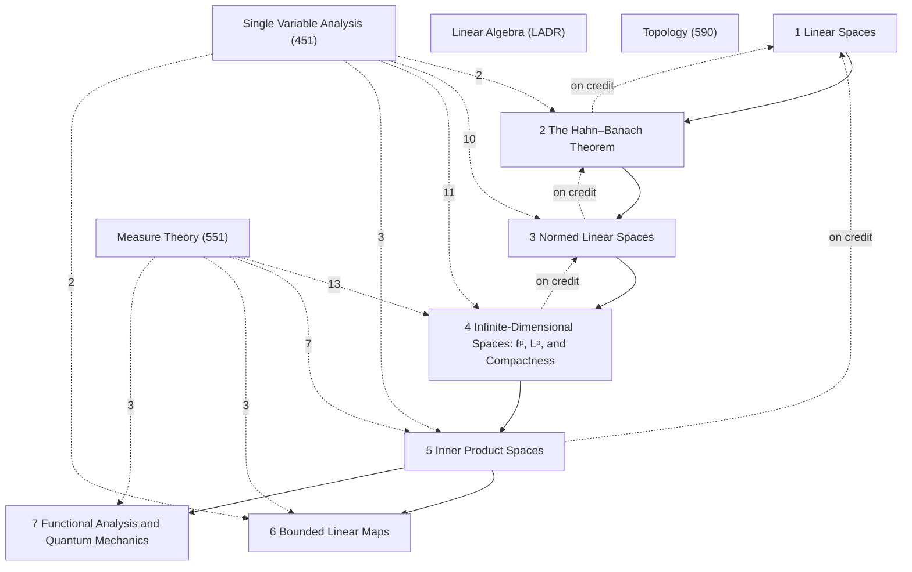

# Functional Analysis

MATH 556, *Applied Functional Analysis* (Fall 2026, Sijue Wu); text Lax, *Functional Analysis* (Chapters 1, 3, 5, 6 and 15). Prerequisites: linear algebra, some complex analysis, advanced calculus; Lebesgue theory is not assumed. Section numbers §1–§27 are the notes' own; every box with a counterpart in Lax ends with it (*Lax: …*), and [[Functional Analysis Lax Concordance]] reads the two side by side. [[Functional Analysis Problem-Solving Techniques]] collects the recurring proof strategies; [[Functional Analysis Course Log]] records the lectures and the homework. LaTeX source (still being extended during the term): `tex/math556_notes.tex`.

## Roadmap
The course moves through three stages of structure on a linear space: pure algebra, with no topology at all (Chapters 1–2); a norm, bringing distance, limits and completeness (Chapters 3–4); and an inner product, bringing angles and orthogonality (Chapter 5). Four threads run across the stages, and most theorems of the course are a step along one of them or a point where two of them meet: [[· 6 Bounded Linear Maps|Chapter 6]] begins the study of linear maps between normed spaces.
- **Functionals**: linear functionals are constructed by Hahn–Banach in the algebraic stage and, on a Hilbert space, are all identified by the Riesz representation theorem.
- **Convexity**: convex sets correspond to positive homogeneous subadditive functions through the gauge; a norm is the gauge of its unit ball; in a Hilbert space a closed convex set has closest points.
- **Completeness**: limits must be produced, not assumed — the completion, the Banach spaces $\ell^p$ and $L^p$, and the convergence of orthonormal expansions.
- **Dimension**: what survives from finite dimensions and what fails — only finite sums in a bare linear space, equivalence of all norms in finite dimensions, the non-compact unit ball, countable orthonormal bases.

The line under each section heading records its stage and thread. [[· 7 Functional Analysis and Quantum Mechanics|Chapter 7]] is a companion, not course material: it translates the results into the language of quantum mechanics.

![[m556-0-1.svg]]
*The roadmap: the four threads (rows) through the three stages (columns). Solid arrows follow a thread from one stage to the next; dashed red arrows mark where threads meet: the separation theorem (Hahn–Banach applied to a gauge), the projection theorem (convexity needing completeness), and the Riesz representation theorem (built on the orthogonal decomposition).*

The boxes, as links: linear functionals ([[§2 Linear Maps, Convexity, and Linear Functionals|§2]]); [[Hahn–Banach Theorem|Hahn–Banach, §3.2]]; [[Norms Are Gauges|a norm is an admissible p, §8.1]]; [[Riesz Representation Theorem (Hilbert spaces)|Riesz representation, §19.2]]; the gauge ([[§5 Convex Sets and the Gauge|§5]]); [[Hyperplane Separation Theorem|separation, §6.1]]; [[Closest Point in a Closed Convex Set|closest point, §18.2]]; [[Completion of a Normed Space|completion, §9.3]]; [[ℓᵖ Is a Banach Space|§13.5]] and [[§14 The Function Spaces Lᵖ(Ω)#^thm-14-3|§14.3]]; [[Orthogonal Decomposition Theorem|orthogonal decomposition, §18.4]]; [[§20 Orthonormal Sets and Bases#^prop-20-6|expansions converge, §20.6]]; only finite sums ([[§1 Linear Spaces#Linear Span|§1.4]]); [[All Norms on a Finite-Dimensional Space Are Equivalent|§10.3]]; [[The Unit Ball of an Infinite-Dimensional Space Is Not Compact|§15.5]]; [[Characterizations of an Orthonormal Basis|Bessel, Parseval, orthonormal bases, §20.8]].

## How the chapters build on each other
Solid arrows: a chapter's proofs rely on the earlier chapter (arrows implied by others are omitted; exact counts are in each chapter note). Dashed arrows labelled "on credit": results used before they are proved (forward references in the notes). Dashed arrows from other subjects: citations of their results, labelled with the number (only arrows with 2 or more citations are drawn).

## Chapters
- [[· 1 Linear Spaces]]
- [[· 2 The Hahn–Banach Theorem]]
- [[· 3 Normed Linear Spaces]]
- [[· 4 Infinite-Dimensional Spaces꞉ ℓᵖ, Lᵖ, and Compactness]]
- [[· 5 Inner Product Spaces]]
- [[· 6 Bounded Linear Maps]]
- [[· 7 Functional Analysis and Quantum Mechanics]] (companion chapter, not lecture material)

## Central results
- [[Every Subspace Has a Complement]] (§1.8)
- [[X ≅ X∕Y ⊕ Y]] (§1.11)
- [[Hahn–Banach Theorem]] (§3.2)
- [[One-Step Extension Lemma]] (§4.1)
- [[Zorn's Lemma]] (§4.2)
- [[The Gauge Is Positive Homogeneous and Subadditive]] (§5.6)
- [[Interior Points via the Gauge]] (§5.7)
- [[Hyperplane Separation Theorem]] (§6.1)
- [[Complex Hahn–Banach Theorem]] (§7.1)
- [[Norms Are Gauges]] (§8.1)
- [[Continuous Functions with the Sup Norm Form a Banach Space]] (§9.1)
- [[Completion of a Normed Space]] (§9.4)
- [[All Norms on a Finite-Dimensional Space Are Equivalent]] (§10.3)
- [[Quotient Norm]] (§10.8)
- [[ℓᵖ Is a Banach Space]] (§13.5)
- [[Riesz's Lemma]] (§15.2)
- [[The Unit Ball of an Infinite-Dimensional Space Is Not Compact]] (§15.5)
- [[Jordan–von Neumann Theorem]] (§17.4)
- [[Closest Point in a Closed Convex Set]] (§18.2)
- [[Orthogonal Decomposition Theorem]] (§18.4)
- [[Riesz Representation Theorem (Hilbert spaces)]] (§19.2)
- [[Bessel's Inequality]] (§20.5)
- [[Characterizations of an Orthonormal Basis]] (§20.8)
- [[Existence of Orthonormal Bases]] (§20.12)
- [[Separable Hilbert Spaces Have Countable Orthonormal Bases]] (§20.17)
- [[Bounded Linear Maps Are Continuous]] (§21.2)
- [[Bounded Linear Maps into a Banach Space Form a Banach Space]] (§21.5)
- [[Bounded Sesquilinear Forms Are Bounded Operators]] (§23.1)
- [[Lax–Milgram Theorem]] (§23.2)

## Summaries
- [[Functional Analysis Lax Concordance]]: notation, where the course's route differs from Lax's, the chapter map, and every Lax result cited in these notes with its counterpart here.
- [[Functional Analysis Problem-Solving Techniques]]: fifteen recurring proof strategies, each with the homework and lecture results that use it.
- [[Functional Analysis Course Log]]: lectures and homework, and where each is in these notes.

## Prerequisites from other subjects
The results from other subjects that this course's proofs and definitions cite most, with the number of citing items. Chapters 1 and 5 re-prove in infinite dimensions much of [[Linear Algebra]] (quotients, complements, inner products, orthogonal complements, Riesz representation); Chapter 4 re-proves or cites the $L^p$ theory of [[Measure Theory]] §19. Their Connections callouts point to those homes.

**[[Linear Algebra]]**
- [[Triangle inequality]] (1)
- [[§4 Span and Linear Independence#^ladr-2-22|Theorem 2.22: Length of linearly independent list ≤ length of spanning list]] (1)

**[[Measure Theory]]**
- [[Countable Union of Countable Sets is Countable]] (4)
- [[Dominated Convergence Theorem]] (3)
- [[§19 Normed Linear Spaces and Lᵖ Spaces#^thm-19-19|Theorem §19.19: Density in Lᵖ]] (3)
- [[Hölder's Inequality]] (2)
- [[Minkowski's Inequality]] (2)
- [[Riesz–Fischer Theorem]] (2)
- [[§19 Normed Linear Spaces and Lᵖ Spaces#^lem-19-4|Lemma §19.4: Young's Inequality]] (1)
- [[§19 Normed Linear Spaces and Lᵖ Spaces#^cor-19-11|Corollary §19.11: Minkowski for Finite Sums]] (1)

**[[Topology]]**
- [[§16 Limit Point Compactness#^thm-16-2|Theorem §16.2: Equivalence for Metrizable Spaces]] (1)

**[[Single Variable Analysis]]**
- [[§10 Monotone Sequences and Cauchy Sequences#^thm-10-8|Theorem §10.8: Cauchy Implies Convergent]] (6)
- [[§33 Properties of the Riemann Integral#^thm-33-3|Theorem §33.3: Monotonicity of the Integral]] (3)
- [[Bolzano–Weierstrass Theorem]] (2)
- [[Fundamental Theorem of Calculus]] (2)
- [[§33 Properties of the Riemann Integral#^thm-33-4|Theorem §33.4: Absolute Values]] (2)
- [[§33 Properties of the Riemann Integral#^thm-33-5|Theorem §33.5: Additivity over Subintervals]] (2)
- [[§33 Properties of the Riemann Integral#^thm-33-2|Theorem §33.2: Linearity]] (2)
- [[Completeness Axiom]] (1)

## Workhorse examples
- [[Norms on ℝⁿ and their unit balls]]: the 1-, 2- and max norms; disk, square and diamond as unit balls and gauges
- [[Sequence spaces ℓᵖ]]: nested Banach spaces of sequences; ℓ² the sequence Hilbert space
- [[Standard unit vectors eₙ]]: the separated sequence; non-compact unit ball, inequivalent norms, basis of ℓ²
- [[Finitely supported sequences c₀₀]]: dense but not closed in ℓᵖ; why closedness hypotheses are needed
- [[Continuous functions on a closed interval]]: C[a,b], complete in the sup norm, completed to Lᵖ in the Lᵖ norms
- [[L² function spaces]]: inner product, even and odd functions, Fourier basis, position in quantum mechanics
