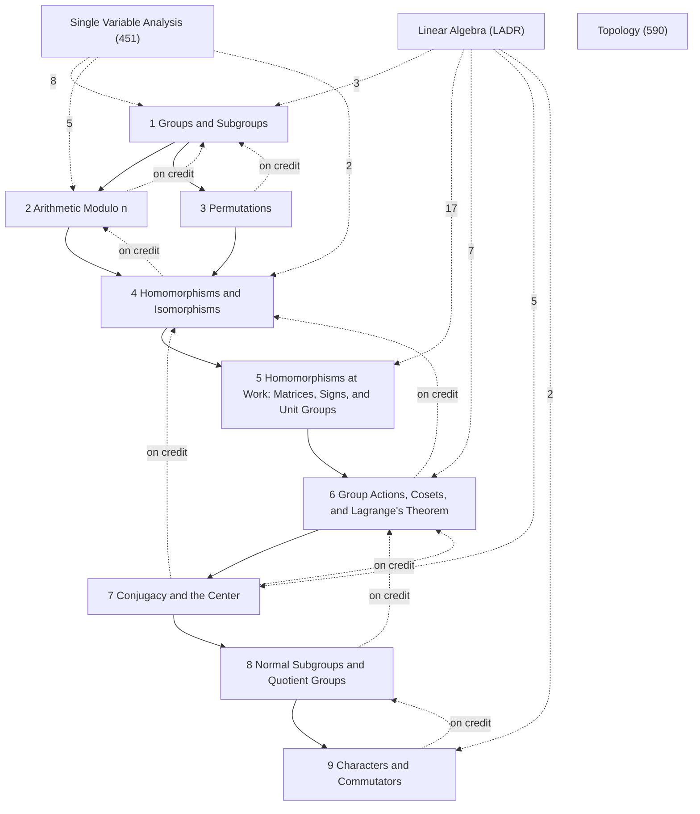

# Group Theory

MATH 493, *Honors Algebra I* (Fall 2026, David Speyer), taught about two-thirds inquiry-based: worksheets on Mondays and Wednesdays, a catch-up lecture and a quiz on Fridays. Classical group theory up to fall break, the representation theory of finite groups after it. Reference text: Pinter, *A Book of Abstract Algebra* (Dummit–Foote alongside). Section numbers §1–§41 are the notes' own; the notes are in logical order, and [[Group Theory — Course Log]] records the order in which things were taught. Provenance tags on items: *WS k.m* = worksheet problem, *PS k.m* = problem set, *lecture*; items marked *not from class*, *cf. Pinter* or *cf. MATH 412* are supplementary. LaTeX source (still being extended during the term): `tex/math493_algebra_notes.tex`.

## Roadmap
These notes follow the course, and the course studies groups through two families of examples and one organizing idea. Along the *numbers* thread live $\mathbb{Z}$, $\mathbb{Z}/n\mathbb{Z}$ and the unit groups $U_n$: abelian, mostly cyclic, and governed by the [[Division Algorithm|division algorithm]]. Along the *symmetries* thread live $S_n$ and $GL_n(k)$: non-abelian, and computed with cycles and matrices. Chapters 1–3 set up both families; Chapters 4–5 compare them through *homomorphisms*, which [[Classification of Cyclic Groups|classify the cyclic groups]] and produce [[The Sign Homomorphism|the sign]] and the [[Group Theory §19 Polynomial Rings, Permutation Matrices, and Representations#^def-19-5|permutation matrices]]. The organizing idea is the *group action* (Chapter 6): an action of $G$ on a set is the same thing as a homomorphism $G \to S_X$ ([[Actions Are Homomorphisms to S_X|§23.3]]). Cosets are the orbits of a subgroup acting by multiplication, which gives [[Lagrange's Theorem]]; conjugation is $G$ acting on itself, which gives conjugacy classes, the [[Class Equation|class equation]] and the [[Group Theory §33 The Center#^def-33-1|center]] (Chapter 7); and the subgroups whose cosets can be multiplied are the normal ones, which gives [[Quotient Groups|quotient groups]] and the [[First Isomorphism Theorem for Groups|First Isomorphism Theorem]] (Chapter 8). The two threads meet again in the [[Group Theory §40 Characters#^def-40-1|characters]] of Chapter 9: homomorphisms to abelian groups, of which the sign is the first example.

![[m493-0-1.svg]]
*The roadmap: the numbers thread (teal), the symmetries thread (violet), and actions (orange); arrow labels are the bridges.*

The labels on the arrows are the bridges. The classification of subgroups of $\mathbb{Z}$ ([[Subgroups of ℤ|§5.1]]) is what makes $\mathbb{Z}/n\mathbb{Z}$ the model finite group, and the [[Classification of Cyclic Groups]] shows every cyclic group is one of these. On the symmetries side, $\sigma \mapsto M(\sigma)$ ([[Group Theory §19 Polynomial Rings, Permutation Matrices, and Representations#^prop-19-5|§19.5]]) turns permutations into matrices, and the determinant then gives the sign ([[The Sign Homomorphism|§20.3]]). The central bridge is [[Actions Are Homomorphisms to S_X]]: every construction below it — cosets and Lagrange ([[Lagrange's Theorem|§27.2]]), orbit–stabilizer ([[Orbit–Stabilizer Theorem|§28.3]]), conjugacy classes and the class equation ([[Class Equation|§32.4]]) — is an action in disguise. Normal subgroups are where the two lower branches meet: they are the unions of conjugacy classes ([[Group Theory §36 Sources of Normal Subgroups#^prop-36-7|§36.7]]) and exactly the subgroups for which coset multiplication is well defined ([[Group Theory §34 Multiplying Cosets#^prop-34-1|§34.1]]), which is what makes $G/N$ a group ([[Quotient Groups|§37.1]]). Finally, characters are constant on conjugacy classes and kill commutators, so they factor through the abelianization $G/[G,G]$ ([[Group Theory §41 Commutators#^def-41-3|Def. §41.3]]); the sign, met on the symmetries thread, is the first nontrivial example.

## How the chapters build on each other
Solid arrows: a chapter's proofs rely on the earlier chapter (arrows implied by others are omitted; exact counts are in each chapter note). Dashed arrows labelled "on credit": results used before they are proved (forward references in the notes). Dashed arrows from other subjects: citations of their results, labelled with the number (only arrows with 2 or more citations are drawn).

## Chapters
- [[Group Theory — 1 Groups and Subgroups]]
- [[Group Theory — 2 Arithmetic Modulo n]]
- [[Group Theory — 3 Permutations]]
- [[Group Theory — 4 Homomorphisms and Isomorphisms]]
- [[Group Theory — 5 Homomorphisms at Work꞉ Matrices, Signs, and Unit Groups]]
- [[Group Theory — 6 Group Actions, Cosets, and Lagrange's Theorem]]
- [[Group Theory — 7 Conjugacy and the Center]]
- [[Group Theory — 8 Normal Subgroups and Quotient Groups]]
- [[Group Theory — 9 Characters and Commutators]]

## Planned topics (syllabus)
First half (before fall break): groups and group actions ✓; the orbit–stabilizer theorem ✓; normal subgroups and quotient groups ✓; the isomorphism theorems (first ✓); the Sylow theorems; composition series and the Jordan–Hölder theorem; simplicity of alternating groups ✓ and of $PSL_n(F)$ (stated); classification of small simple groups (maybe up to order 168); solvable and nilpotent groups; semidirect products; central and abelian extensions, ideally culminating in the Schur–Zassenhaus theorem. Second half: the representation theory of finite groups.

## Central results
- [[Cancellation Laws in Groups]] (§2.1)
- [[Subgroup Criteria]] (§4.2)
- [[Exponent Laws]] (§4.4)
- [[Subgroups of ℤ]] (§5.1)
- [[Bézout's Identity]] (§5.2)
- [[Division Algorithm]] (§6.1)
- [[Descent Lemma]] (§7.2)
- [[Euclid's Lemma]] (§9.1)
- [[Unique Prime Factorization]] (§9.2)
- [[Chinese Remainder Theorem]] (§9.3)
- [[Disjoint Cycle Decomposition]] (§11.3)
- [[Conjugation Relabels a Cycle]] (§12.1)
- [[Injective iff Trivial Kernel]] (§15.3)
- [[Classification of Cyclic Groups]] (§17.1)
- [[Subgroups of Cyclic Groups Are Cyclic]] (§17.4)
- [[The Sign Homomorphism]] (§20.3)
- [[Actions Are Homomorphisms to S_X]] (§23.3)
- [[Cayley's Theorem]] (§23.5)
- [[Cosets Partition a Group]] (§26.2)
- [[Lagrange's Theorem]] (§27.2)
- [[Groups of Prime Order Are Cyclic]] (§27.7)
- [[Orbit–Stabilizer Theorem]] (§28.3)
- [[Burnside's Lemma]] (§28.6)
- [[Conjugacy Classes of Sₙ Are Cycle Types]] (§31.2)
- [[Class Equation]] (§32.4)
- [[p-Groups Have Nontrivial Center]] (§33.3)
- [[Characterizations of Normality]] (§35.2)
- [[Kernels Are Normal]] (§36.2)
- [[Quotient Groups]] (§37.1)
- [[First Isomorphism Theorem for Groups]] (§38.1)
- [[Aₙ Is Simple for n ≥ 5]] (§39.9)

## Summaries
- [[Group Theory — Conventions and Notation]]: symbols and the course's conventions (right-to-left composition, $e$ for the identity, …), each linked to where it is defined.
- [[Group Theory — Toolkit]]: how to show $H \le G$, well-definedness, (non-)isomorphism, normality; standard examples; exam traps.
- [[Group Theory — Course Log]]: what was taught when, and where it is in these notes.
- Problem sets: [[Group Theory — Problem Set 1|PS 1]], [[Group Theory — Problem Set 2|PS 2]], [[Group Theory — Problem Set 3|PS 3]].

## Prerequisites from other subjects
The results from other subjects that this course's proofs and definitions cite most, with the number of citing items. Each chapter note gives per-chapter counts; each hub note lists its own cross-subject dependencies. The group theory summarized in [[Topology §21 Algebra Prerequisites꞉ Groups|Topology §21]] is developed here in full.

**[[Linear Algebra]]**
- [[Linear Algebra 9C Determinants#^ladr-9-49|9.49 Determinant is multiplicative]] (4)
- [[Linear Algebra 9C Determinants#^ladr-9-50|9.50 Invertible ⟺ nonzero determinant]] (3)
- [[Linear Algebra 3A Vector Space of Linear Maps#^ladr-3-4|3.4 Linear map lemma]] (3)
- [[Linear Algebra 9C Determinants#^ladr-9-57|9.57 Helpful results in evaluating determinants]] (3)
- [[Linear Algebra 3C Matrices#^ladr-3-43|3.43 Matrix of product of linear maps]] (2)
- [[Linear Algebra 3C Matrices#^ladr-3-31|3.31 Matrix of a linear map, M(T)]] (2)
- [[Linear Algebra 9C Determinants#^ladr-9-44|9.44 Determinants of matrices (p. 355)]] (2)
- [[Linear Algebra 2A Span and Linear Independence#^ladr-2-15|2.15 Linearly independent]] (1)

**[[Single Variable Analysis]]**
- [[Single Variable Analysis §1 The Set ℕ of Natural Numbers#^thm-1-1|Theorem §1.1: Principle of Mathematical Induction]] (12)
- [[Single Variable Analysis §4 The Completeness Axiom#^cor-4-4|Corollary §4.4: Completeness for Infima]] (1)
- [[Single Variable Analysis §4 The Completeness Axiom#^prop-4-3|Proposition §4.3: Characterization of the Supremum]] (1)
- [[Single Variable Analysis §4 The Completeness Axiom#^thm-4-5|Theorem §4.5: Archimedean Property]] (1)
- [[Single Variable Analysis §2 The Set ℚ of Rational Numbers#^thm-2-1|Theorem §2.1: Irrationality of √2]] (1)
- [[Single Variable Analysis §1 The Set ℕ of Natural Numbers#^rem-1-3|Remark (strong induction)]] (1)

**[[Topology]]**
- [[Topology §21 Algebra Prerequisites꞉ Groups#^prop-21-4|Proposition §21.4: Bijectivity via Two-Sided Inverse]] (1)

## Workhorse examples
- [[Matrix groups GLₙ, SLₙ and O(n)]]: $GL_n(k)$ and its subgroups $SL_n$, $O(n)$, $SO(n)$; the determinant as homomorphism and character
- [[Rotation group of the cube]]: the order-24 rotation group acting on faces, edges, vertices, colours and diagonals; $\cong S_4$
- [[S₄, A₄ and the Klein four-group]]: class equation and normal subgroups of $S_4$; $A_4$ has no subgroup of order 6 and is not simple
- [[The alternating group A₅]]: the smallest non-abelian simple group, proved simple from its class sizes
- [[The integers ℤ and the subgroups nℤ]]: the infinite cyclic group; its subgroups $n\mathbb{Z}$ underlie Bézout and the unit groups
- [[The symmetric group S₃]]: the smallest non-abelian group, the first test case for cosets, normality and conjugacy
- [[ℤ∕nℤ and the unit groups Uₙ]]: the cyclic groups $\mathbb{Z}/n\mathbb{Z}$ and unit groups $U_n$; tables, isomorphisms and CRT structure
