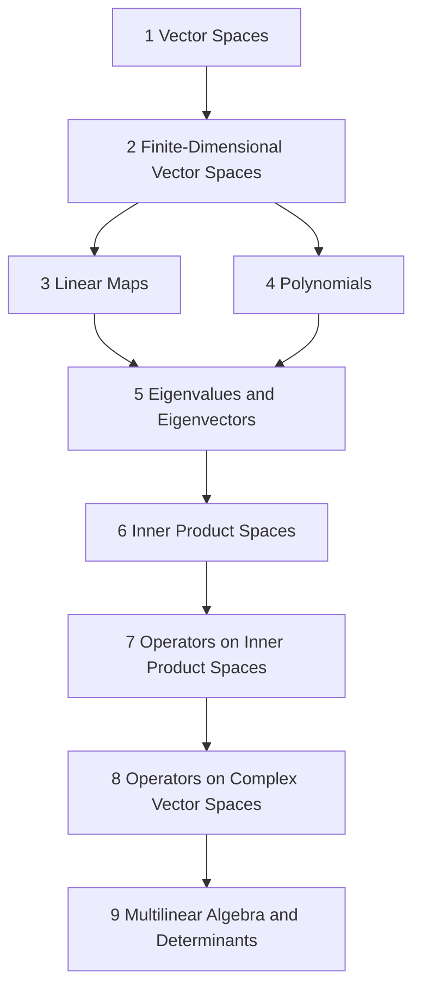

# Linear Algebra

Built on Axler, *Linear Algebra Done Right*, 4th edition (Springer, 2024), open access under [CC BY-NC 4.0](https://creativecommons.org/licenses/by-nc/4.0/). Statements and proofs in these notes are written in my own words following Axler's numbering and proof routes; item numbers and titles are Axler's. PDF: `refs/Axler LADR.pdf` (from https://linear.axler.net).

## How the chapters build on each other
Arrows show which chapters a chapter's proofs rely on (redundant arrows implied by others are omitted; exact counts are in each chapter note).

## Chapters
- [[· 1 Vector Spaces]]
- [[· 2 Finite-Dimensional Vector Spaces]]
- [[· 3 Linear Maps]]
- [[· 4 Polynomials]]
- [[· 5 Eigenvalues and Eigenvectors]]
- [[· 6 Inner Product Spaces]]
- [[· 7 Operators on Inner Product Spaces]]
- [[· 8 Operators on Complex Vector Spaces]]
- [[· 9 Multilinear Algebra and Determinants]]
