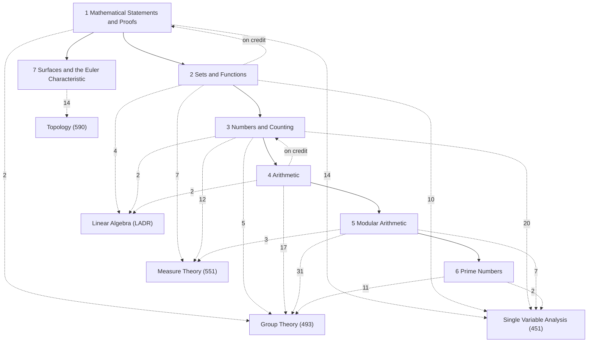

# Logic and Proofs

MAT 250, *Introduction to Mathematics* (Stony Brook University, Fall 2024): logic, proof, sets and functions, counting, and elementary number theory, from Peter J. Eccles, *An Introduction to Mathematical Reasoning: Numbers, Sets and Functions* (Cambridge University Press, 1998). I took the parallel course MAT 200 (*Logic, Language and Proof*, Helfer) for its first three weeks and then moved up to MAT 250, which covers the same material at a more advanced level; the logic of §1–§2 and §7 therefore also draws on MAT 200's supplement and practice midterm. These are written notes, a synthesis of the sources, not a transcription: §1–§24 follow Eccles's Chapters 1–24 one to one (§N is Eccles's Chapter N, and every box names its Eccles item in an *Eccles:* line), and §25 is the course's lecture unit on surfaces. *Source:* lines give everything else: *HW k* (my homework, worked in full), *MAT 200 supplement*, *Rational Number Project* (my own construction of ℚ, in §22), *Sundstrom* (*Mathematical Reasoning: Writing and Proof*, open textbook).

This subject is the foundation of the others. Where a later subject proves the same fact again (induction in [[Single Variable Analysis]], countability in [[Measure Theory]], the arithmetic of ℤ in [[Group Theory]]), both proofs are kept: the item here carries a folded *Connections* callout saying where it is developed further, and the later item links back to its elementary version here.

Sections marked ★ ([[§12★ Counting Functions and Subsets|§12★]], [[§18★ Linear Diophantine Equations|§18★]], [[§24★ Congruence Modulo a Prime|§24★]]) appear in neither my homework nor the MAT 200 schedule; they are included from Eccles to complete the arithmetic.

## How the chapters build on each other
Solid arrows: a chapter's proofs rely on the earlier chapter (arrows implied by others are omitted; exact counts are in each chapter note). Dashed arrows labelled "on credit": results used before they are proved. Dashed arrows to other subjects: where the material is developed further, labelled with the number of *Connections* links (only arrows with 2 or more are drawn).

## Chapters
- [[· 1 Mathematical Statements and Proofs]]
- [[· 2 Sets and Functions]]
- [[· 3 Numbers and Counting]]
- [[· 4 Arithmetic]]
- [[· 5 Modular Arithmetic]]
- [[· 6 Prime Numbers]]
- [[· 7 Surfaces and the Euler Characteristic]]

## Central results
- [[Logical Identities]] (§1.1)
- [[Contrapositive, Converse and Inverse]] (§2.2)
- [[Strong Induction Principle]] (§5.6)
- [[Well-Ordering Principle]] (§5.7)
- [[Laws of the Algebra of Sets]] (§6a.2)
- [[Negating Quantifiers]] (§7.2)
- [[Invertible Means Bijective]] (§9.2)
- [[Addition Principle]] (§10.4)
- [[Inclusion–Exclusion Principle]] (§10.9)
- [[Pigeonhole Principle]] (§11.2)
- [[Finite Sets Have a Maximum and a Minimum]] (§11.9)
- [[Binomial Theorem]] (§12.10)
- [[The Rationals Are Denumerable]] (§14.10)
- [[The Reals Are Uncountable]] (§14a.2)
- [[Euclidean Algorithm]] (§16.3)
- [[Solvability of Linear Congruences]] (§20.5)
- [[Equivalence Relations Are Partitions]] (§22.4)
- [[Construction of the Rational Numbers]] (§22a.4)
- [[Infinitely Many Primes]] (§23.8)
- [[Fermat's Little Theorem]] (§24.1)
- [[Euler Characteristic of Surfaces]] (§25.6)

## Course record
MAT 250 had no published schedule. The left column is the MAT 200 weekly plan (the same material at the standard level); the right column is my MAT 250 work, by the week folder it was filed in.

| Week | MAT 200 plan (Eccles reading) | My MAT 250 work → notes |
|---|---|---|
| 1–2 | Propositions, connectives, truth tables, quantifiers, negation (1, 2.1, 6.1, 7.1–7.2, 7.6) | MAT 200 HW1 → §1, §2, §6, §7 |
| 3 | Midterm 1 | Practice midterm → §1, §2, §7 |
| 4 | Axioms, definitions, direct proof (2.2–2.3, 3) | HW1 (Eccles 3–5) → §3–§5 |
| 5–6 | Contraposition, contradiction, quantified statements (4, 7.3–7.4) | HW2 (Problems I) → §2–§5; HW3 (6–8) → §6–§8 |
| 7 | Induction, strong induction (5, 7.5) | — |
| 8–9 | Sets, functions, bijections, Peano's axioms (6, 8, 7.7, 9) | HW4 (9, 13) → §9, §13; HW5 (14) → §14 |
| 10 | Midterm 2 | HW6 (Euler characteristic, 15) → §25, §15 |
| 11–12 | Congruences, linear congruences, congruence classes (19–21) | HW7 (16–17) → §16, §17; HW8 (23) → §23 |
| 13 | Equivalence relations, quotient sets, constructions of ℤ and ℚ (22) | Rational Number Project (October) → §22 |
| 14–15 | Finite sets, inclusion–exclusion, pigeonhole; countable sets, Cantor, Cantor–Schröder–Bernstein (10–11, 14) | — |

## Developed further in
Number of *Connections* links from these notes to each subject: [[Group Theory]] (67), [[Single Variable Analysis]] (54), [[Measure Theory]] (22), [[Topology]] (16), [[Linear Algebra]] (9).
