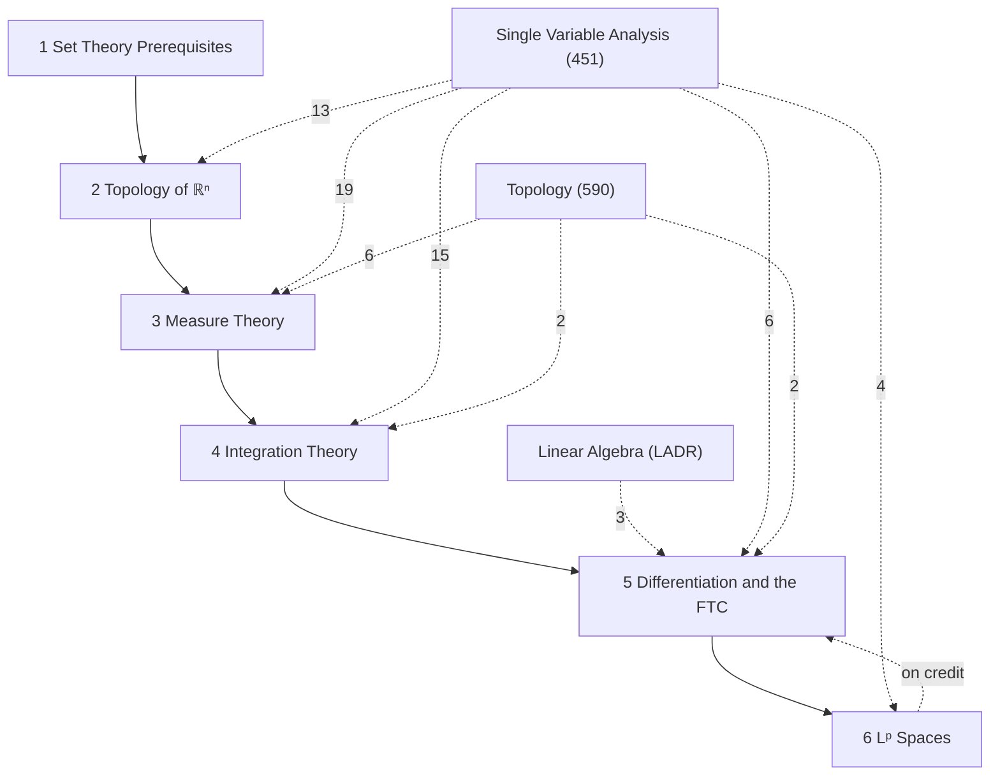

# Measure Theory

MATH 551, *Introduction to Real Analysis* (Winter 2026, Sijue Wu), following Axler, *Measure, Integration & Real Analysis* (chapters 1–5); references Royden–Fitzpatrick, Tao *An Introduction to Measure Theory*, Stein–Shakarchi *Real Analysis*. Section numbers §1–§19 are the notes' own. LaTeX source: `tex/math551_notes.tex`.

## How the chapters build on each other
Solid arrows: a chapter's proofs rely on the earlier chapter (arrows implied by others are omitted; exact counts are in each chapter note). Dashed arrows labelled "on credit": results used before they are proved. Dashed arrows from other subjects: citations of their results, labelled with the number (only arrows with 2 or more citations are drawn).

## Chapters
- [[· 1 Set Theory Prerequisites]]
- [[· 2 Topology of ℝⁿ]]
- [[· 3 Measure Theory]]
- [[· 4 Integration Theory]]
- [[· 5 Differentiation and the FTC]]
- [[· 6 Lᵖ Spaces]]

## Summary
- [[Measure Theory Problem-Solving Techniques]]: 21 recurring proof strategies from the homework, each linked to the results it relies on.

## Prerequisites from other subjects
The results from other subjects that this course's proofs and definitions cite most, with the number of citing items. Each chapter note gives per-chapter counts; each hub note lists its own cross-subject dependencies.

**[[Single Variable Analysis]]**
- [[§3 The Set ℝ of Real Numbers#^thm-3-3|Theorem §3.3: Properties of the Absolute Value]] (6)
- [[§4 The Completeness Axiom#^thm-4-7|Theorem §4.7: Density of ℚ in ℝ]] (4)
- [[Archimedean Property]] (3)
- [[Characterization of the Supremum]] (3)
- [[§10 Monotone Sequences and Cauchy Sequences#^def-10-3|Definition §10.3: Lim Sup and Lim Inf]] (3)
- [[§10 Monotone Sequences and Cauchy Sequences#^thm-10-6|Theorem §10.6: Convergence via Lim Sup and Lim Inf]] (3)
- [[§14 Series#^ex-14-4|Example §14.4: The geometric series]] (3)
- [[Monotone Convergence Theorem]] (2)

**[[Topology]]**
- [[§6 Closed Sets and Limit Points#^thm-6-1|Theorem §6.1: Properties of Closed Sets]] (3)
- [[§11 Metric Topology#^def-11-1|Definition §11.1: Metric]] (2)
- [[§9 Continuous Functions#^def-9-1|Definition §9.1: Continuous Function]] (1)
- [[§11 Metric Topology#^thm-11-9|Theorem §11.9: Continuity and Sequences]] (1)
- [[§9 Continuous Functions#^thm-9-4|Theorem §9.4: Rules for Continuous Functions]] (1)
- [[§15 Compact Spaces#^rem-15-1|Remark: Why Compactness Matters]] (1)
- [[Continuous Image of a Compact Space is Compact]] (1)
- [[Heine–Borel Theorem]] (1)

**[[Linear Algebra]]**
- [[Triangle inequality]] (1)
- [[Invertible ⟺ nonzero determinant]] (1)
- [[§34 Determinants#^ladr-9-49|9.49 Determinant is multiplicative]] (1)
- [[§34 Determinants#^ladr-9-61|9.61 T changes volume by factor of |det T|]] (1)
- [[§2 Definition of Vector Space#^ladr-1-20|1.20 Vector space]] (1)

## Workhorse examples
- [[Cantor set and Cantor function]]
- [[Escaping mass sequences]]
- [[Power sequence xᵏ]]
- [[Power singularities 1∕xᵃ]]
- [[Rationals ℚ]]
- [[Vitali set]]
