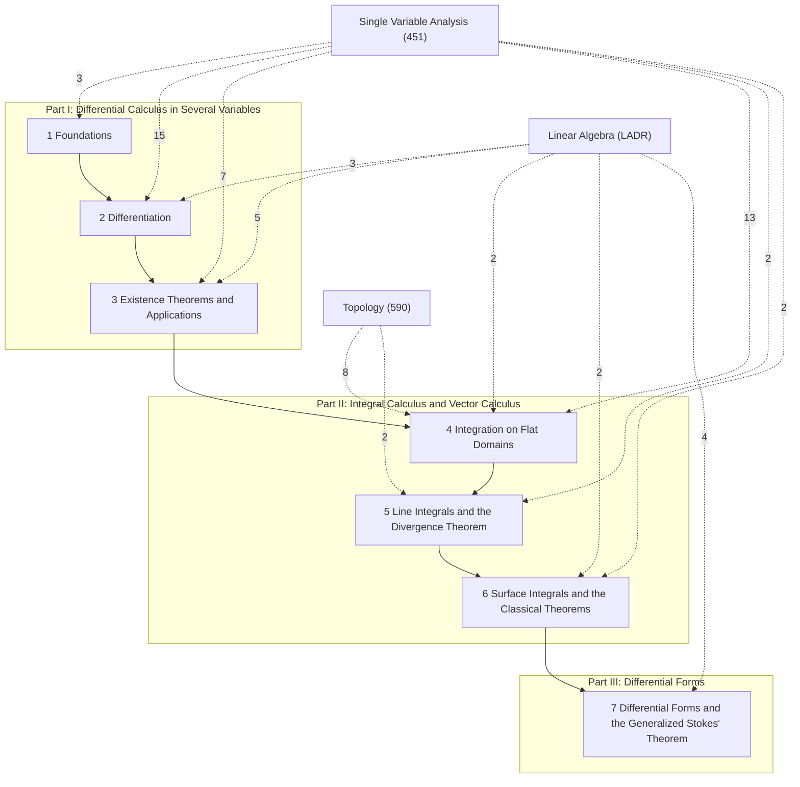

# Multivariable Analysis

MATH 452 (Winter 2026, Tian Jing), following Courant & John, *Introduction to Calculus and Analysis*, Vol. II. Further references: Edwards, *Advanced Calculus of Several Variables*; Rudin, *Principles of Mathematical Analysis*; Spivak, *Calculus on Manifolds*. Section numbers §1–§23 are the notes' own. LaTeX source: `tex/math452_notes.tex`; the 3D figures are generated by `attachments/math452/src/make_figures.py`.

Topics: open and closed sets; partial derivatives, differentiability, mean value theorem; gradient, directional derivatives, chain rule; implicit and inverse function theorems; extrema and Lagrange multipliers; multiple integrals and change of variables; line and surface integrals; Green, divergence and Stokes theorems; differential forms and the generalized Stokes theorem.

## How the chapters build on each other
Solid arrows: a chapter's proofs rely on the earlier chapter (arrows implied by others are omitted; exact counts are in each chapter note). Dashed arrows: citations of results from other subjects, labelled with their number (only arrows with 2 or more citations are drawn).

## Chapters

**Part I: Differential Calculus in Several Variables**
- [[Multivariable Analysis — 1 Foundations]]
- [[Multivariable Analysis — 2 Differentiation]]
- [[Multivariable Analysis — 3 Existence Theorems and Applications]]

**Part II: Integral Calculus and Vector Calculus**
- [[Multivariable Analysis — 4 Integration on Flat Domains]]
- [[Multivariable Analysis — 5 Line Integrals and the Divergence Theorem]]
- [[Multivariable Analysis — 6 Surface Integrals and the Classical Theorems]]

**Part III: Differential Forms**
- [[Multivariable Analysis — 7 Differential Forms and the Generalized Stokes' Theorem]]

## Prerequisites from other subjects
The results from other subjects that this course's proofs and definitions cite most, with the number of citing items. Each chapter note gives per-chapter counts; each hub note lists its own cross-subject dependencies.

**[[Single Variable Analysis]]**
- [[Mean Value Theorem]] (6)
- [[Single Variable Analysis §3 The Set ℝ of Real Numbers#^thm-3-3|Theorem §3.3: Properties of the Absolute Value]] (5)
- [[Single Variable Analysis §20 Limits of Functions#^rem-20-2|Remark]] (3)
- [[Single Variable Analysis §29 The Mean Value Theorem#^thm-29-1|Theorem §29.1: Interior Extremum Theorem]] (3)
- [[Fundamental Theorem of Calculus]] (3)
- [[Single Variable Analysis §28 Basic Properties of the Derivative#^thm-28-1|Theorem §28.1: Differentiable Implies Continuous]] (2)
- [[Single Variable Analysis §31 Taylor's Theorem#^thm-31-2|Theorem §31.2: Taylor's Theorem with Lagrange Remainder]] (2)
- [[Single Variable Analysis §19 Uniform Continuity#^thm-19-1|Theorem §19.1: Uniform Continuity on Closed Bounded Intervals]] (2)

**[[Linear Algebra]]**
- [[Linear Algebra 3A Vector Space of Linear Maps#^ladr-3-1|3.1 Linear map]] (2)
- [[Linear Algebra 2A Span and Linear Independence#^ladr-2-15|2.15 Linearly independent]] (2)
- [[Linear Algebra 3C Matrices#^ladr-3-31|3.31 Matrix of a linear map, M(T)]] (1)
- [[Linear Algebra 3C Matrices#^ladr-3-41|3.41 Matrix multiplication]] (1)
- [[Linear Algebra 3D Invertibility and Isomorphisms#^ladr-3-80|3.80 Invertible, inverse, A⁻¹]] (1)
- [[Linear Algebra 9A Bilinear Forms and Quadratic Forms#^ladr-9-11|9.11 Symmetric matrix]] (1)
- [[Linear Algebra 9C Determinants#^ladr-9-49|9.49 Determinant is multiplicative]] (1)
- [[Linear Algebra 9C Determinants#^ladr-9-61|9.61 T changes volume by factor of ∣det T∣]] (1)

**[[Topology]]**
- [[Heine–Borel Theorem]] (3)
- [[Continuous Image of a Compact Space is Compact]] (3)
- [[Topology §15 Compact Spaces#^rem-15-1|Remark: Why Compactness Matters]] (2)
- [[Topology §13 Connected Spaces#^def-13-1|Definition §13.1: Separation and Connected Space]] (2)

## Workhorse examples
- [[2xy∕(x²+y²) family]]
- [[Angle form on the punctured plane]]
- [[Polar and spherical coordinates]]
- [[Radial functions]]
- [[Unit circle and unit sphere]]
