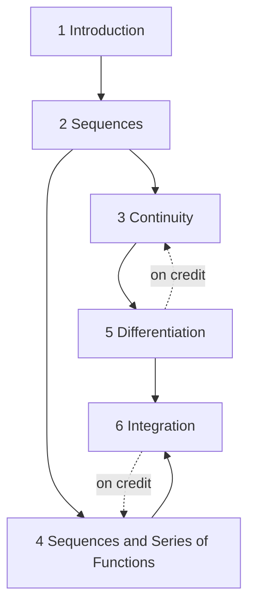

# Single Variable Analysis

MATH 451 (Fall 2025, Lizhen Ji), following Ross, *Elementary Analysis*. Section numbers are Ross's. LaTeX source: `tex/math451_notes.tex`.

## How the chapters build on each other
Solid arrows: a chapter's proofs rely on the earlier chapter (arrows implied by others omitted). Dashed arrows: results used *on credit* before they are proved in the course (e.g. the Mean Value Theorem in §19).

## Chapters
- [[Single Variable Analysis — 1 Introduction]]
- [[Single Variable Analysis — 2 Sequences]]
- [[Single Variable Analysis — 3 Continuity]]
- [[Single Variable Analysis — 4 Sequences and Series of Functions]]
- [[Single Variable Analysis — 5 Differentiation]]
- [[Single Variable Analysis — 6 Integration]]

## Workhorse examples
- [[Reciprocal function 1∕x]]
- [[Geometric series]]
- [[sin(1∕x) family]]
- [[Dirichlet and Thomae functions]]
