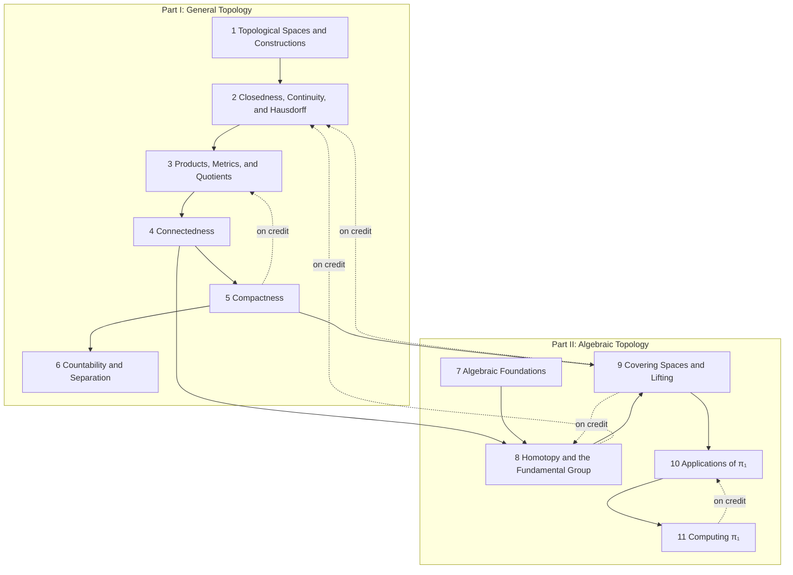

# Topology

MATH 590 (Winter 2026, Linh Truong), following Munkres, *Topology* (2nd ed.). Section numbers §1–§40 are the notes' own. Each section note's `munkres` property gives the matching Munkres section. LaTeX source: `tex/math590_topology_notes.tex`.

## How the chapters build on each other
Solid arrows: a chapter's proofs rely on the earlier chapter (arrows implied by others are omitted; exact counts are in each chapter note). Dashed arrows: results used *on credit* before they are proved in the course.

## Chapters
**Part I: General Topology**
- [[· 1 Topological Spaces and Constructions]]
- [[· 2 Closedness, Continuity, and Hausdorff]]
- [[· 3 Products, Metrics, and Quotients]]
- [[· 4 Connectedness]]
- [[· 5 Compactness]]
- [[· 6 Countability and Separation]]

**Part II: Algebraic Topology**
- [[· 7 Algebraic Foundations]]
- [[· 8 Homotopy and the Fundamental Group]]
- [[· 9 Covering Spaces and Lifting]]
- [[· 10 Applications of π₁]]
- [[· 11 Computing π₁]]

## Summary
- [[Algebraic Topology Toolkit]]: the four tools for computing π₁, a decision tree, and a table of computed fundamental groups.

## Prerequisites from other subjects
The results from other subjects that this course's proofs and definitions cite (with the number of citing items). Most connections to MATH 451 and Linear Algebra are conceptual and live in the Connections callouts rather than in proofs; each chapter note gives per-chapter counts.

**[[Single Variable Analysis]]**
- [[Extreme Value Theorem]] (1)
- [[§13 Some Topological Concepts in Metric Spaces#^def-13-new1|Definition §13.2: Cauchy Sequence in a Metric Space]] (1)
- [[§4 The Completeness Axiom#^thm-4-7|Theorem §4.7: Density of ℚ in ℝ]] (1)

**[[Linear Algebra]]**
- [[§5 Bases#^ladr-2-26|2.26 Basis]] (1)

**[[Group Theory]]**
- [[First Isomorphism Theorem for Groups]] (2)

## Workhorse examples
- [[Lower limit topology]]
- [[K-topology]]
- [[Box and product topologies on ℝ^ω]]
- [[Discrete and indiscrete topologies]]
- [[Punctured plane]]
- [[Figure eight]]
- [[Torus]]
- [[Double torus]]
- [[Projective plane]]
