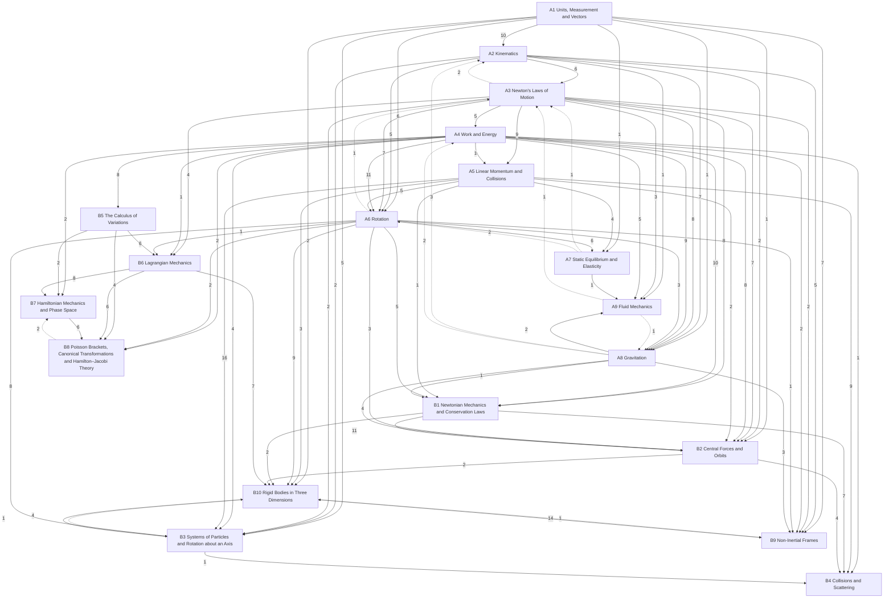

# Classical Mechanics

The mechanics of particles, rigid bodies and fluids, in three levels: **A** introductory (University Physics Vol. 1; PHY 181), **B** upper-level (Newtonian, Lagrangian and Hamiltonian mechanics; PHY 421, the series Part II), **C** graduate (classical field theory and beyond). Statements are marked by layer: *principles* (assumed), *laws* (empirical, with their range), *theorems* (derived, with a derivation and a *Uses:* line) and *models* (idealisations). Oscillations, waves and sound are in [[Oscillations, Waves and Optics]]; relativistic mechanics in [[Relativity]].

## Level A — introductory
- [[· A1 Units, Measurement and Vectors]]
- [[· A2 Kinematics]]
- [[· A3 Newton's Laws of Motion]]
- [[· A4 Work and Energy]]
- [[· A5 Linear Momentum and Collisions]]
- [[· A6 Rotation]]
- [[· A7 Static Equilibrium and Elasticity]]
- [[· A8 Gravitation]]
- [[· A9 Fluid Mechanics]]

## Level B — upper
- [[· B1 Newtonian Mechanics and Conservation Laws]]
- [[· B2 Central Forces and Orbits]]
- [[· B3 Systems of Particles and Rotation about an Axis]]
- [[· B4 Collisions and Scattering]]
- [[· B5 The Calculus of Variations]]
- [[· B6 Lagrangian Mechanics]]
- [[· B7 Hamiltonian Mechanics and Phase Space]]
- [[· B8 Poisson Brackets, Canonical Transformations and Hamilton–Jacobi Theory]]
- [[· B9 Non-Inertial Frames]]
- [[· B10 Rigid Bodies in Three Dimensions]]

### How the chapters build on each other
Arrows point from a chapter to the chapters that use it; labels count the citations from statements, derivations and *Uses:* lines. Dashed arrows are forward references.

## Planned
Chapters without notes yet; sources in brackets (∅ = no typed source).

**Level B — upper (PHY 421, Marion & Thornton, series Part II)**
B1 Newtonian mechanics and conservation theorems · B2 Central forces and orbits · B3 Systems of particles, rigid bodies about an axis · B4 Collisions and scattering [Landau] · B5 Calculus of variations [series II] · B6 Lagrangian mechanics, constraints, Noether [series II] · B7 Hamiltonian mechanics, phase space, Liouville [series II] · B8 Poisson brackets, canonical transformations, Hamilton–Jacobi [series II] · B9 Non-inertial frames [∅] · B10 3D rigid bodies, Euler equations, tops [∅]

**Level C — graduate**
C1 Classical field theory [series III; PHY 505 typed notes] · C2 Elasticity and fluids as field theories [PHY 505 typed notes] · C3 Action-angle variables, adiabatic invariants, perturbation theory [∅] · C4 Nonlinear dynamics and chaos [∅] · C5 Geometric mechanics [∅]

PHY 421's lecture notes are handwritten scans, so level B is planned from the typed sources: the series Part II, the PHY 421 homework sets, and Marion & Thornton.
