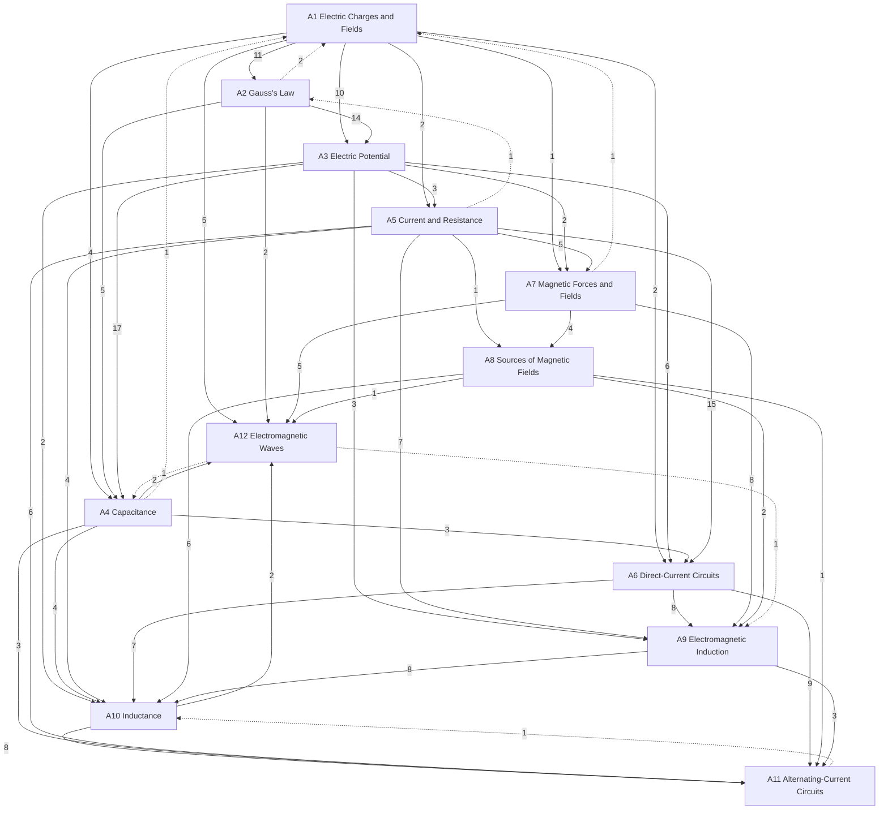

# Electromagnetism

Electric and magnetic fields, their sources, circuits, induction and electromagnetic waves, in three levels: **A** introductory (University Physics Vol. 2; PHY 182), **B** upper-level (Griffiths; PHY 422), **C** graduate (PHY 505; the series Part III). Statements are marked by layer: *principles* (assumed), *laws* (empirical, with their range), *theorems* (derived, with a derivation and a *Uses:* line) and *models* (idealisations). The mechanics it uses is in [[Classical Mechanics]]; optics is in Oscillations, Waves and Optics; the covariant formulation and relativistic electrodynamics are at level C here.

## Level A — introductory
- [[· A1 Electric Charges and Fields]]
- [[· A2 Gauss's Law]]
- [[· A3 Electric Potential]]
- [[· A4 Capacitance]]
- [[· A5 Current and Resistance]]
- [[· A6 Direct-Current Circuits]]
- [[· A7 Magnetic Forces and Fields]]
- [[· A8 Sources of Magnetic Fields]]
- [[· A9 Electromagnetic Induction]]
- [[· A10 Inductance]]
- [[· A11 Alternating-Current Circuits]]
- [[· A12 Electromagnetic Waves]]

### How the chapters build on each other
Arrows point from a chapter to the chapters that use it; labels count the citations from statements, derivations and *Uses:* lines. Dashed arrows are forward references.

## Planned
Chapters without notes yet; sources in brackets (∅ = no typed source).

**Level B — upper (PHY 422, Griffiths)**
B1 Electrostatics: field, potential, energy · B2 Boundary-value problems: Laplace, uniqueness, images, separation of variables · B3 Multipole expansion · B4 Dielectrics · B5 Magnetostatics, vector potential · B6 Magnetization · B7 Induction, Maxwell's equations, conservation laws · B8 EM waves in vacuum and matter [PHY 300, Fowles 1] · B9 Potentials and radiation [Schwartz 15c lectures; otherwise ∅]
PHY 422's lecture notes are handwritten scans; level B is planned from the typed PHY 422 homework sets and solutions and Griffiths.

**Level C — graduate (PHY 505)**
C1 Electrostatics II: Green's functions, capacitance matrix [PHY 505 HW; Zangwill] · C2 Multipoles II [PHY 505 HW8; the user's multipole-lattice paper] · C3 Covariant electrodynamics [series Part III; PHY 505 typed notes] · C4 Media from the action, monopoles, Chern–Simons [PHY 505 typed notes] · C5 Radiation from moving charges [∅] · C6 Waveguides and cavities [∅]
