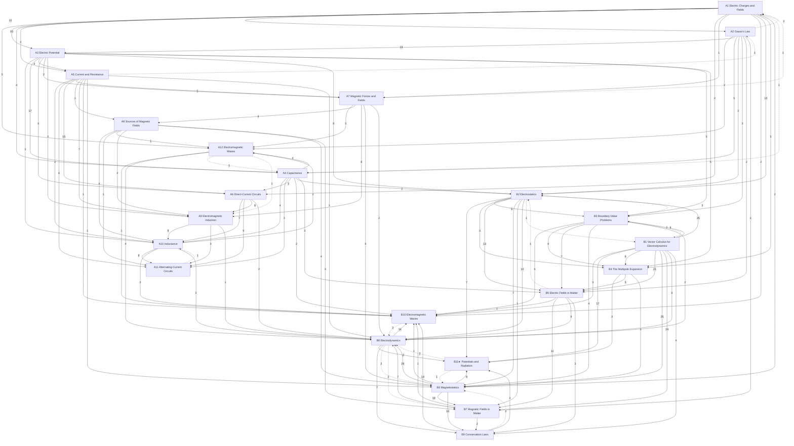

# Electromagnetism

Electric and magnetic fields, their sources, circuits, induction and electromagnetic waves, in three levels: **A** introductory (University Physics Vol. 2; PHY 182), **B** upper-level (Griffiths; PHY 422; Nelson's PHYS 5516 notes, Schwartz's Physics 15c lectures and McDonald's note as supplements), **C** graduate (PHY 505; the series Part III). Statements are marked by layer: *principles* (assumed), *laws* (empirical, with their range), *theorems* (derived, with a derivation and a *Uses:* line) and *models* (idealisations). The mechanics it uses is in [[Classical Mechanics]]; optics is in [[Oscillations, Waves and Optics]], which also owns plane waves in media, the Fresnel equations, dispersion and skin depth; the covariant formulation and relativistic electrodynamics are at level C here. At level B, ★ marks material beyond the course (PHY 422: Griffiths ch. 1–9, its homework and exams): whole sections are starred in the lists below, and folded ★ callouts inside a section are side topics.

## Level A — introductory
- [[· A1 Electric Charges and Fields]]
- [[· A2 Gauss's Law]]
- [[· A3 Electric Potential]]
- [[· A4 Capacitance]]
- [[· A5 Current and Resistance]]
- [[· A6 Direct-Current Circuits]]
- [[· A7 Magnetic Forces and Fields]]
- [[· A8 Sources of Magnetic Fields]]
- [[· A9 Electromagnetic Induction]]
- [[· A10 Inductance]]
- [[· A11 Alternating-Current Circuits]]
- [[· A12 Electromagnetic Waves]]

## Level B — upper
- [[· B1 Vector Calculus for Electrodynamics]]
- [[· B2 Electrostatics]]
- [[· B3 Boundary-Value Problems]]
- [[· B4 The Multipole Expansion]]
- [[· B5 Electric Fields in Matter]]
- [[· B6 Magnetostatics]]
- [[· B7 Magnetic Fields in Matter]]
- [[· B8 Electrodynamics]]
- [[· B9 Conservation Laws]]
- [[· B10 Electromagnetic Waves]] (★ §B10.3, §B10.4)
- [[· B11★ Potentials and Radiation]]

### How the chapters build on each other
Arrows point from a chapter to the chapters that use it; labels count the citations from statements, derivations and *Uses:* lines. Dashed arrows are forward references.

## Planned
Chapters without notes yet; sources in brackets (∅ = no typed source).

**Level C — graduate (PHY 505)**
C1 Electrostatics II: Green's functions, capacitance matrix [PHY 505 HW; Zangwill] · C2 Multipoles II [PHY 505 HW8; the user's multipole-lattice paper] · C3 Covariant electrodynamics [series Part III; PHY 505 typed notes; Griffiths ch. 12; Nelson ch. 32–38] · C4 Media from the action, monopoles, Chern–Simons [PHY 505 typed notes; Nelson ch. 39] · C5 Radiation from moving charges beyond Griffiths: general multipole radiation, Abraham–Lorentz–Dirac [Nelson ch. 41–44] · C6 Waveguides and cavities beyond Griffiths 9.5 [∅]
