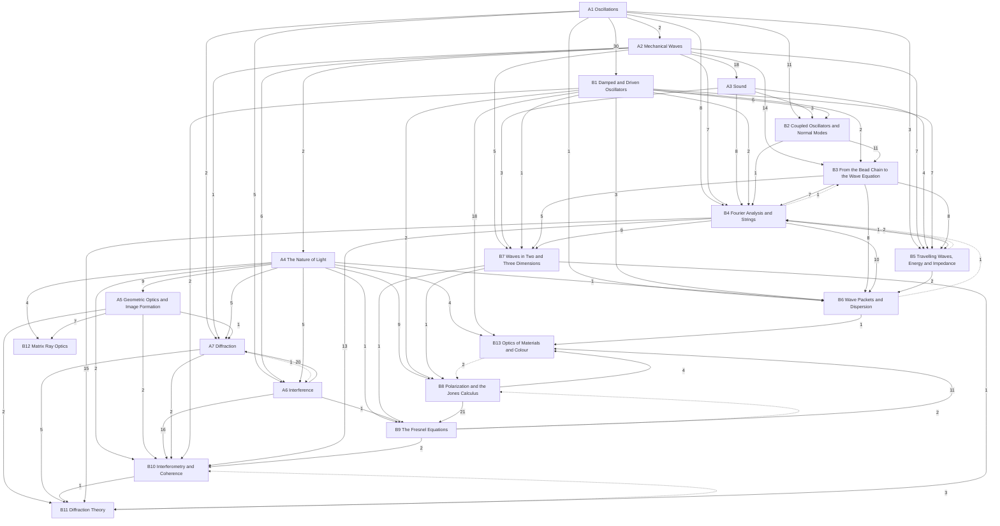

# Oscillations, Waves and Optics

Oscillators, mechanical and sound waves, and light as a wave and as rays, in three levels: **A** introductory (University Physics Vol. 1 ch. 15–17 and Vol. 3 ch. 1–4; PHY 287), **B** upper-level (PHY 300; French; Fowles; Schwartz's Physics 15c lectures; the series Part I), **C** graduate. Statements are marked by layer: *principles* (assumed), *laws* (empirical, with their range), *theorems* (derived, with a derivation and a *Uses:* line) and *models* (idealisations). The mechanics it uses is in [[Classical Mechanics]]; electromagnetic waves themselves are in [[Electromagnetism]].

## Level A — introductory
- [[· A1 Oscillations]]
- [[· A2 Mechanical Waves]]
- [[· A3 Sound]]
- [[· A4 The Nature of Light]]
- [[· A5 Geometric Optics and Image Formation]]
- [[· A6 Interference]]
- [[· A7 Diffraction]]

## Level B — upper
- [[· B1 Damped and Driven Oscillators]]
- [[· B2 Coupled Oscillators and Normal Modes]]
- [[· B3 From the Bead Chain to the Wave Equation]]
- [[· B4 Fourier Analysis and Strings]]
- [[· B5 Travelling Waves, Energy and Impedance]]
- [[· B6 Wave Packets and Dispersion]]
- [[· B7 Waves in Two and Three Dimensions]]
- [[· B8 Polarization and the Jones Calculus]]
- [[· B9 The Fresnel Equations]]
- [[· B10 Interferometry and Coherence]]
- [[· B11 Diffraction Theory]]
- [[· B12 Matrix Ray Optics]]
- [[· B13 Optics of Materials and Colour]]

### How the chapters build on each other
Arrows point from a chapter to the chapters that use it; labels count the citations from statements, derivations and *Uses:* lines. Dashed arrows are forward references.

## Planned
Chapters without notes yet; sources in brackets (∅ = no typed source).

**Level B — upper, optics (PHY 300; Fowles; Schwartz Physics 15c lectures)** — B1–B7 are written (above).
B8 Polarization and Jones calculus [Schwartz 14; Fowles 2] · B9 Fresnel equations, total internal reflection [Schwartz 15; Fowles 2] · B10 Interferometry and coherence [Fowles 3–4] · B11 Fraunhofer and Fresnel diffraction, resolution [Schwartz 19; Fowles 5] · B12 Matrix ray optics [Fowles 10] · B13 Optics of materials, colour [Schwartz 16–17; Fowles 6]
PHY 300's lectures are handwritten scans, and French's and Fowles's books are scans without a text layer (Fowles would need OCR).

**Level C — graduate**
C1 Fourier optics and scalar diffraction theory [∅] · C2 Lasers and Gaussian beams [Fowles 9] · C3 Statistical optics [∅] · C4 Waveguides and fibres [∅] · C5 Nonlinear optics [∅]
