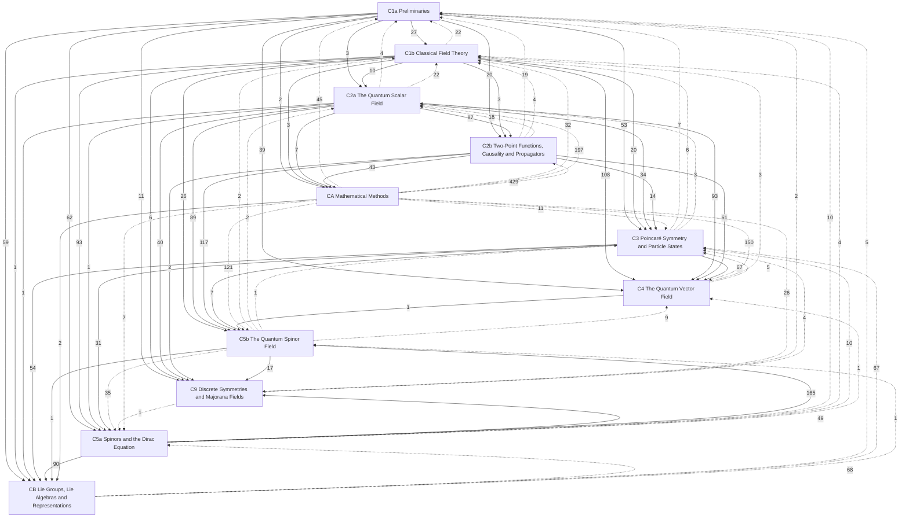

# Quantum Field Theory

Relativistic quantum field theory at the graduate level (**C**, PHY 513, Larsen, Fall 2026; textbook Peskin & Schroeder). Chapters follow Yu Zhao-Huan's lecture notes (余钊焕《量子场论讲义》), whose chapter numbers they keep: fields are organized by spin after the Poincaré group, and interactions are treated once for all fields. Each concept has one home: statements are short boxes, derivations are folded under them, explanations are titled remarks, and hidden connections are collected in each note's Connections. Multi-step procedures have their own notes in Procedures/, linked from every place they are carried out. Statements are marked by layer: *principles* (postulated), *theorems* (derived, with a derivation and a *Uses:* line) and *models* (idealized systems). ★ marks material beyond the PHY 513 syllabus; a *draft* banner marks syllabus topics written ahead of the lectures. Relativity is in [[Relativity]], one-particle quantum mechanics in [[Quantum Mechanics]]. Procedures: [[P1 Canonical Quantization]], [[P2 Green's Functions by Contour Integration]]. Reference card: [[Scalar Field Card]]. Two mathematics chapters collect the tools the physics uses: [[· CA Mathematical Methods]] (limits, generalized functions, Fourier transforms, contours) and [[· CB Lie Groups, Lie Algebras and Representations]] (Lie groups and algebras, complexification, representations, Clifford algebras and the spin groups). The course order, lecture by lecture, is in [[PHY 513 Course Log]]; conventions in [[Larsen PHY 513]].

## Level C — graduate
- [[· C1a Preliminaries]]
- [[· C1b Classical Field Theory]]
- [[· C2a The Quantum Scalar Field]]
- [[· C2b Two-Point Functions, Causality and Propagators]]
- [[· C3 Poincaré Symmetry and Particle States]] (★ §C3.6, §C3.7)
- [[· C4 The Quantum Vector Field]] (★ §C4.2, §C4.3, §C4.4, §C4.5)
- [[· C5a Spinors and the Dirac Equation]]
- [[· C5b The Quantum Spinor Field]]
- [[· C9 Discrete Symmetries and Majorana Fields]] (★ §C9.2)
- [[· CA Mathematical Methods]]
- [[· CB Lie Groups, Lie Algebras and Representations]] (★ §CB.19)

### How the chapters build on each other
Arrows point from a chapter to the chapters that use it; labels count the citations from statements, derivations and *Uses:* lines. Dashed arrows are forward references.

## Planned
Chapters without notes yet (Yu's numbering).

**Level C — PHY 513 (Larsen, Fall 2026; Peskin & Schroeder; Yu)**
C6 Interactions of quantum fields · C7 Feynman diagrams · C8 Quantum electrodynamics · C9 Discrete symmetries and Majorana fields (started: parity, §C9.1–§C9.4; charge conjugation, time reversal, CPT and Majorana fields pending) · C10 The S-matrix and correlation functions · C11 Path-integral quantization

**Mathematics chapter CB** (started 2026-10-08; sections renumbered §CB.0–§CB.20 for "option 1", physics refers to mathematics): [[· CB Lie Groups, Lie Algebras and Representations]] has its full logical chain (every definition and theorem, in order, with course boxes embedded) and proofs, except those still marked *Proof (to be filled)* (the Lie correspondence in §CB.2, Bargmann's theorem in §CB.18, Mackey and Wigner–Mackey in §CB.19★); the mathematical statements of C3 moved into CB in batch B1 (2026-10-08; C3 regrouped into §C3.1–§C3.5 with "The mathematics used here" blocks), those of C1a, C5a and C9 move in batches B2–B3, and §CB.0 (linear algebra in components) is filled then; §CB.20 Grassmann algebras is completed with C11.
