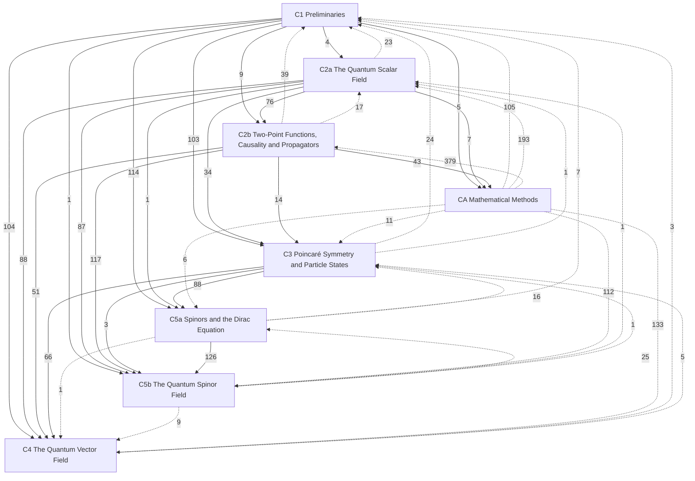

# Quantum Field Theory

Relativistic quantum field theory at the graduate level (**C**, PHY 513, Larsen, Fall 2026; textbook Peskin & Schroeder). Chapters follow Yu Zhao-Huan's lecture notes (余钊焕《量子场论讲义》), whose chapter numbers they keep: fields are organized by spin after the Poincaré group, and interactions are treated once for all fields. Each concept has one home: statements are short boxes, derivations are folded under them, explanations are titled remarks, and hidden connections are collected in each note's Connections. Multi-step procedures have their own notes in Procedures/, linked from every place they are carried out. Statements are marked by layer: *principles* (postulated), *theorems* (derived, with a derivation and a *Uses:* line) and *models* (idealized systems). ★ marks material beyond the PHY 513 syllabus; a *draft* banner marks syllabus topics written ahead of the lectures. Relativity is in [[Relativity]], one-particle quantum mechanics in [[Quantum Mechanics]]. Procedures: [[P1 Canonical Quantization]], [[P2 Green's Functions by Contour Integration]]. Reference card: [[Scalar Field Card]]. The course order, lecture by lecture, is in [[PHY 513 Course Log]]; conventions in [[Larsen PHY 513]].

## Level C — graduate
- [[· C1 Preliminaries]]
- [[· C2a The Quantum Scalar Field]]
- [[· C2b Two-Point Functions, Causality and Propagators]]
- [[· C3 Poincaré Symmetry and Particle States]] (★ §C3.5, §C3.6)
- [[· C4 The Quantum Vector Field]] (★ §C4.2, §C4.3, §C4.4)
- [[· C5a Spinors and the Dirac Equation]]
- [[· C5b The Quantum Spinor Field]]
- [[· CA Mathematical Methods]]

### How the chapters build on each other
Arrows point from a chapter to the chapters that use it; labels count the citations from statements, derivations and *Uses:* lines. Dashed arrows are forward references.

## Planned
Chapters without notes yet (Yu's numbering).

**Level C — PHY 513 (Larsen, Fall 2026; Peskin & Schroeder; Yu)**
C6 Interactions of quantum fields · C7 Feynman diagrams · C8 Quantum electrodynamics · C9 Discrete symmetries and Majorana fields · C10 The S-matrix and correlation functions · C11 Path-integral quantization
