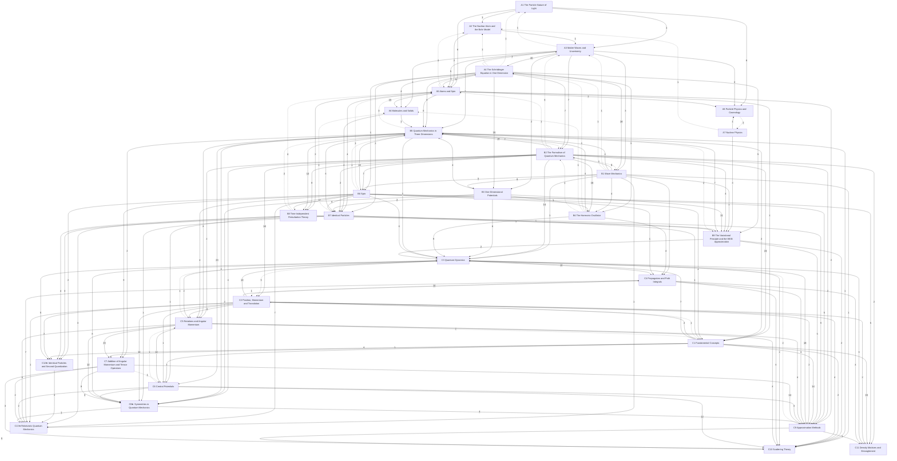

# Quantum Mechanics

The quantum behaviour of light and matter and its applications to atoms, molecules, solids, nuclei and particles, in three levels: **A** introductory (University Physics Vol. 3 ch. 6–11; Tipler & Llewellyn; PHY 284), **B** upper-level (PHY 308; Griffiths & Schroeter; Zwiebach's MIT 8.04 notes, Fleisch and Greensite as supplements; the user's own Potential solutions, WKB and Classical notes), **C** graduate (PHY 511–512; Sakurai & Napolitano; the user's 511 final review and lecture-notes series Part IV; Griffiths & Schroeter and Likharev as supplements; hydrogen and radiation in Gaussian units). Statements are marked by layer: *principles* (assumed), *laws* (empirical, with their range), *theorems* (derived, with a derivation and a *Uses:* line) and *models* (idealisations). Special relativity is in [[Relativity]]; the Hilbert-space mathematics is in [[Functional Analysis]]. At levels B and C, ★ marks material beyond the course (PHY 308, resp. PHY 511–512: their syllabi, homework and the user's notes): whole chapters and sections are starred in the lists below, and folded ★ callouts inside a section are side topics. Level B is wave-function-centred, level C ket-and-operator-centred: where both treat a result, C links the B home and says what changes.

## Level A — introductory
- [[· A1 The Particle Nature of Light]]
- [[· A2 The Nuclear Atom and the Bohr Model]]
- [[· A3 Matter Waves and Uncertainty]]
- [[· A4 The Schrödinger Equation in One Dimension]]
- [[· A5 Atoms and Spin]]
- [[· A6 Molecules and Solids]]
- [[· A7 Nuclear Physics]]
- [[· A8 Particle Physics and Cosmology]]

## Level B — upper
- [[· B1 Wave Mechanics]]
- [[· B2 The Formalism of Quantum Mechanics]]
- [[· B3 One-Dimensional Potentials]]
- [[· B4 The Harmonic Oscillator]]
- [[· B5 Quantum Mechanics in Three Dimensions]]
- [[· B6 Spin]]
- [[· B7 Identical Particles]] (★ §B7.3)
- [[· B8 Time-Independent Perturbation Theory]] (★ §B8.2, §B8.4)
- [[· B9 The Variational Principle and the WKB Approximation]] (★ §B9.1, §B9.2)

## Level C — graduate
- [[· C1 Fundamental Concepts]]
- [[· C2 Position, Momentum and Translation]]
- [[· C3 Quantum Dynamics]]
- [[· C4 Propagators and Path Integrals]]
- [[· C5 Rotations and Angular Momentum]]
- [[· C6 Central Potentials]]
- [[· C7 Addition of Angular Momentum and Tensor Operators]]
- [[· C8★ Symmetries in Quantum Mechanics]]
- [[· C9 Approximation Methods]]
- [[· C10 Scattering Theory]]
- [[· C11 Density Matrices and Entanglement]] (★ §C11.4, §C11.5)
- [[· C12★ Identical Particles and Second Quantization]]
- [[· C13★ Relativistic Quantum Mechanics]]

### How the chapters build on each other
Arrows point from a chapter to the chapters that use it; labels count the citations from statements, derivations and *Uses:* lines. Dashed arrows are forward references.

## Planned
No chapters planned. Not covered at level C: the general (Racah) formula for Clebsch–Gordan coefficients, Young tableaux and a proof of spin–statistics; quantized fields continue in [[Quantum Field Theory I]].
