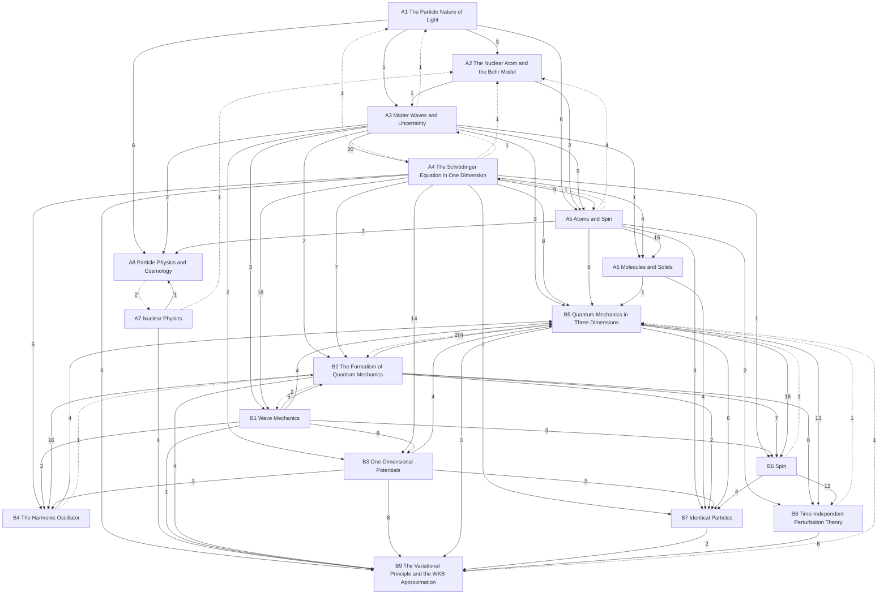

# Quantum Mechanics

The quantum behaviour of light and matter and its applications to atoms, molecules, solids, nuclei and particles, in three levels: **A** introductory (University Physics Vol. 3 ch. 6–11; Tipler & Llewellyn; PHY 284), **B** upper-level (PHY 308), **C** graduate (PHY 511). Statements are marked by layer: *principles* (assumed), *laws* (empirical, with their range), *theorems* (derived, with a derivation and a *Uses:* line) and *models* (idealisations). Special relativity is in [[Relativity]]; the Hilbert-space mathematics is in [[Functional Analysis]].

## Level A — introductory
- [[· A1 The Particle Nature of Light]]
- [[· A2 The Nuclear Atom and the Bohr Model]]
- [[· A3 Matter Waves and Uncertainty]]
- [[· A4 The Schrödinger Equation in One Dimension]]
- [[· A5 Atoms and Spin]]
- [[· A6 Molecules and Solids]]
- [[· A7 Nuclear Physics]]
- [[· A8 Particle Physics and Cosmology]]

## Level B — upper
- [[· B1 Wave Mechanics]]
- [[· B2 The Formalism of Quantum Mechanics]]
- [[· B3 One-Dimensional Potentials]]
- [[· B4 The Harmonic Oscillator]]
- [[· B5 Quantum Mechanics in Three Dimensions]]
- [[· B6 Spin]]
- [[· B7 Identical Particles]] (★ §B7.3)
- [[· B8 Time-Independent Perturbation Theory]] (★ §B8.2, §B8.4)
- [[· B9 The Variational Principle and the WKB Approximation]] (★ §B9.1, §B9.2)

### How the chapters build on each other
Arrows point from a chapter to the chapters that use it; labels count the citations from statements, derivations and *Uses:* lines. Dashed arrows are forward references.

## Planned
Chapters without notes yet; sources in brackets (∅ = no typed source).

**Level B — upper (PHY 308; Griffiths)**
B1 Formalism: Hilbert space, operators, postulates [PHY 308 ch. 3–4; links Functional Analysis §22–23] · B2 One-dimensional potentials [PHY 308 ch. 5; the user's Potential solutions notes] · B3 Harmonic oscillator, ladder operators, coherent states [PHY 308 ch. 6] · B4 QM in 3D, angular momentum, hydrogen [PHY 308 ch. 7–9] · B5 Spin and addition of angular momentum [PHY 308 ch. 10] · B6 Identical particles [PHY 308 ch. 11] · B7 Approximation methods: WKB, perturbation theory, variational [the user's WKB notes; PHY 308 HW6; partly ∅]

**Level C — graduate (PHY 511; Sakurai; the user's 511 final review; series Part IV)**
C1 Fundamental concepts: Stern–Gerlach, kets, measurement, change of basis · C2 Position, momentum, translations · C3 Dynamics: pictures, two-state systems, oscillator · C4 Propagators, path integrals, Aharonov–Bohm · C5 Rotations, SU(2)/SO(3), angular-momentum spectrum · C6 Central potentials and hydrogen · C7 Addition of angular momentum, tensor operators, Wigner–Eckart · C8 Symmetries and approximation methods [PHY 512: ∅] · C9 Scattering [∅] · C10 Density matrices and entanglement [∅] · C11 Relativistic QM [∅; bridge to QFT]
