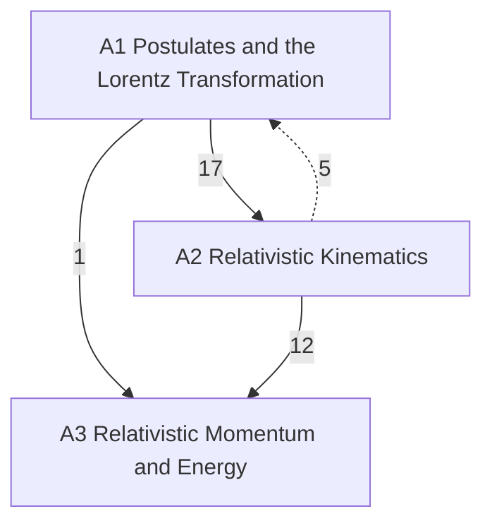

# Relativity

Special relativity from Einstein's postulates, then (planned) its geometry and general relativity, in three levels: **A** introductory (University Physics Vol. 3 ch. 5; Tipler & Llewellyn ch. 1–2; Morin; PHY 284), **B** upper-level (Minkowski geometry, the equivalence principle), **C** graduate (general relativity). Statements are marked by layer: *principles* (assumed), *laws* (empirical, with their range), *theorems* (derived, with a derivation and a *Uses:* line) and *models* (idealisations). Newtonian mechanics is in [[Classical Mechanics]], electromagnetism in [[Electromagnetism]].

## Level A — introductory
- [[· A1 Postulates and the Lorentz Transformation]]
- [[· A2 Relativistic Kinematics]]
- [[· A3 Relativistic Momentum and Energy]]

### How the chapters build on each other
Arrows point from a chapter to the chapters that use it; labels count the citations from statements, derivations and *Uses:* lines. Dashed arrows are forward references.

## Planned
Chapters without notes yet; sources in brackets (∅ = no typed source).

**Level B — upper**
B1 Minkowski geometry, four-vectors, tensors [series Part III; PHY 408 L1 (handwritten); Hartle 4–5] · B2 Relativistic particle and charged particle from an action [series Part III] · B3 Relativistic continua: stress-energy, perfect fluid [PHY 408 L1 (handwritten)] · B4 Equivalence principle and weak-field metric [Hartle 6–7; PHY 360 slides]

**Level C — graduate**
C1 Geometry for GR [Couzens GR1 §3–4; home in Differentiable Manifolds, linked] · C2 Einstein equations, Einstein–Hilbert action [GR1 §5] · C3 Schwarzschild and classical tests [GR1 §6] · C4 Linearised gravity and gravitational waves [GR2] · C5 Relativistic stars, TOV [GR2] · C6 Causal structure, Penrose diagrams, horizons [GR2] · C7 Charged and rotating black holes [GR2] · C8 Black-hole thermodynamics, Hawking radiation [GR2; PHY 360 project] · C9 Cosmology [∅]
