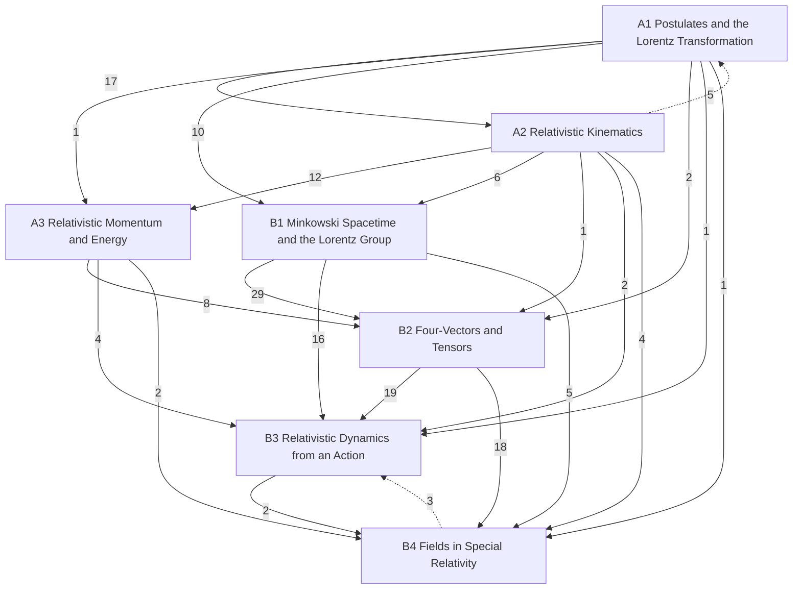

# Relativity

Special relativity from Einstein's postulates, then its covariant (tensor) form, then general relativity, in three levels: **A** introductory (University Physics Vol. 3 ch. 5; Tipler & Llewellyn ch. 1–2; Morin; PHY 284), **B** upper-level: special relativity in covariant form (the user's own PHY 505 notes and lecture-notes series Part III; PHY 505; Morin, Schutz and Griffiths ch. 12 as supplements), **C** graduate: general relativity (not yet taken as a course; the PHY 408 and PHY 360 folders are audit material). Statements are marked by layer: *principles* (assumed), *laws* (empirical, with their range), *theorems* (derived, with a derivation and a *Uses:* line) and *models* (idealisations). Level B uses the signature η = diag(+1, −1, −1, −1) and keeps c explicit. Newtonian mechanics is in [[Classical Mechanics]], electromagnetism in [[Electromagnetism]]; the covariant formulation of electrodynamics proper (Maxwell from a Lagrangian, the field energy–momentum tensor) is Electromagnetism level C, and §B4.2 here applies the tensor machinery to the field tensor.

## Level A — introductory
- [[· A1 Postulates and the Lorentz Transformation]]
- [[· A2 Relativistic Kinematics]]
- [[· A3 Relativistic Momentum and Energy]]

## Level B — upper
- [[· B1 Minkowski Spacetime and the Lorentz Group]]
- [[· B2 Four-Vectors and Tensors]]
- [[· B3 Relativistic Dynamics from an Action]]
- [[· B4 Fields in Special Relativity]]

### How the chapters build on each other
Arrows point from a chapter to the chapters that use it; labels count the citations from statements, derivations and *Uses:* lines. Dashed arrows are forward references.

## Planned
Chapters without notes yet; sources in brackets (∅ = no typed source).

**Level C — graduate (general relativity)**
C1 Relativistic continua: stress-energy, dust, perfect fluids [Schutz 4; PHY 408 L1 (handwritten, audit)] · C2 Equivalence principle and the weak-field metric [Schutz 5, 7; Hartle 6–7; PHY 360 slides (audit)] · C3 Geometry for GR [Couzens GR1 §3–4; Schutz 5–6; home in Differentiable Manifolds, linked] · C4 Einstein equations, Einstein–Hilbert action [GR1 §5] · C5 Schwarzschild and classical tests [GR1 §6] · C6 Linearised gravity and gravitational waves [GR2] · C7 Relativistic stars, TOV [GR2] · C8 Causal structure, Penrose diagrams, horizons, Rindler [GR2] · C9 Charged and rotating black holes [GR2] · C10 Black-hole thermodynamics, Hawking radiation [GR2; PHY 360 project] · C11 Cosmology [∅]
