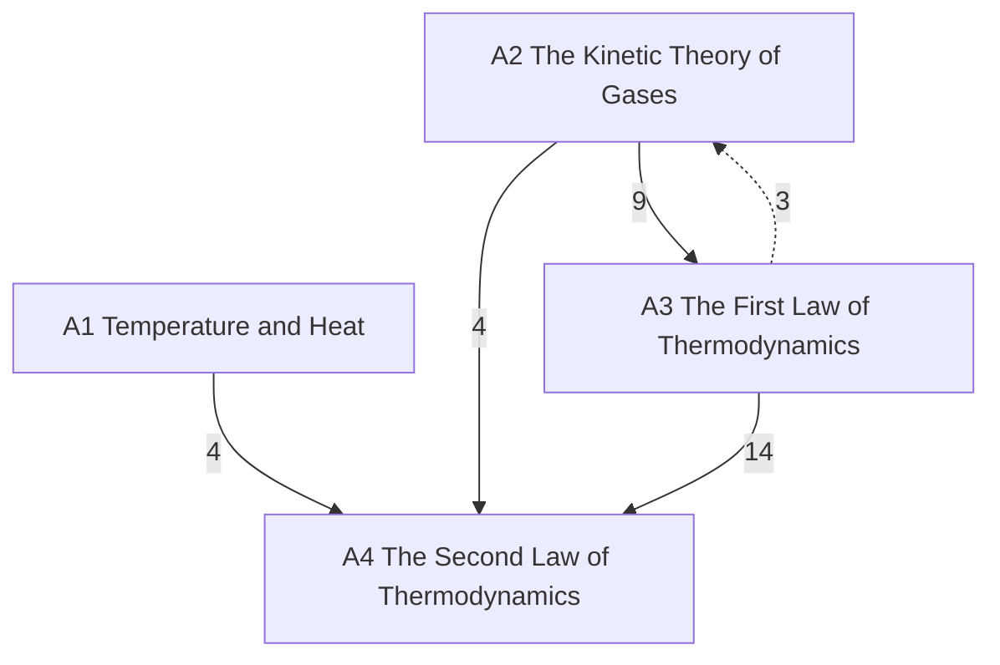

# Thermal and Statistical Physics

Temperature, heat, the kinetic theory of gases and the laws of thermodynamics, then statistical mechanics, in three levels: **A** introductory (University Physics Vol. 2; PHY 287), **B** upper-level (PHY 306; Blundell; Schwartz's statistical-mechanics lectures; the user's own notes), **C** graduate. Statements are marked by layer: *principles* (assumed), *laws* (empirical, with their range), *theorems* (derived, with a derivation and a *Uses:* line) and *models* (idealisations). The mechanics it uses is in [[Classical Mechanics]].

## Level A — introductory
- [[· A1 Temperature and Heat]]
- [[· A2 The Kinetic Theory of Gases]]
- [[· A3 The First Law of Thermodynamics]]
- [[· A4 The Second Law of Thermodynamics]]

### How the chapters build on each other
Arrows point from a chapter to the chapters that use it; labels count the citations from statements, derivations and *Uses:* lines. Dashed arrows are forward references.

## Planned
Chapters without notes yet; sources in brackets (∅ = no typed source).

**Level B — upper (PHY 306, Blundell; Schwartz Physics 181 lectures; the user's "Stat Mech concepts" notes)**
B1 Mathematical toolkit: exact differentials, Legendre transforms · B2 The laws formally: Clausius, third law · B3 Potentials, Maxwell relations, response functions · B4 Probability: central limit theorem, random walks · B5 Kinetic theory and transport, H-theorem [Schwartz] · B6 Microcanonical ensemble, entropy, information, Gibbs paradox · B7 Canonical and grand canonical ensembles · B8 Classical ideal gas, equipartition · B9 Phases and phase transitions, van der Waals [Schwartz] · B10 Quantum statistics [Schwartz] · B11 Photons and phonons [Schwartz] · B12 Bose–Einstein condensation [Schwartz] · B13 Fermi gases: metals, semiconductors, stars [Schwartz]
PHY 306's lectures are handwritten scans; level B is planned from the typed sources above.

**Level C — graduate**
C1 Foundations: Liouville, ergodicity [Schwartz, brief] · C2 Ising model, mean field, Landau theory [∅] · C3 Critical phenomena and the renormalization group [∅] · C4 Fluctuations and linear response [∅] · C5 Non-equilibrium: Boltzmann, Langevin, Onsager [∅] · C6 Density matrix [∅]
