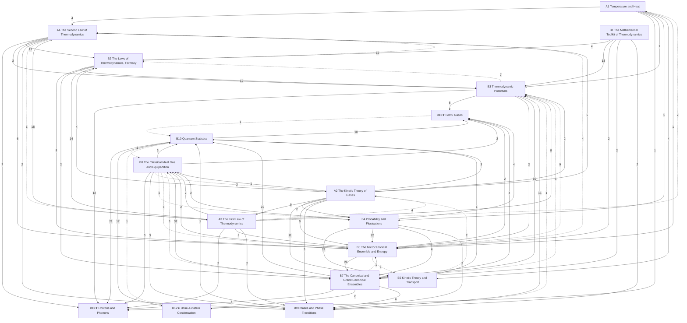

# Thermal and Statistical Physics

Temperature, heat, the kinetic theory of gases and the laws of thermodynamics, then statistical mechanics, in three levels: **A** introductory (University Physics Vol. 2; PHY 287), **B** upper-level (PHY 306; Schroeder; Blundell; Schwartz's statistical-mechanics lectures; the user's own notes), **C** graduate. Statements are marked by layer: *principles* (assumed), *laws* (empirical, with their range), *theorems* (derived, with a derivation and a *Uses:* line) and *models* (idealisations). The mechanics it uses is in [[Classical Mechanics]]. At level B, ★ marks material beyond the course (PHY 306: its syllabus, problem sets and the user's notes): whole sections are starred in the lists below, and folded ★ callouts inside a section are side topics.

## Level A — introductory
- [[· A1 Temperature and Heat]]
- [[· A2 The Kinetic Theory of Gases]]
- [[· A3 The First Law of Thermodynamics]]
- [[· A4 The Second Law of Thermodynamics]]

## Level B — upper
- [[· B1 The Mathematical Toolkit of Thermodynamics]]
- [[· B2 The Laws of Thermodynamics, Formally]]
- [[· B3 Thermodynamic Potentials]] (★ §B3.4)
- [[· B4 Probability and Fluctuations]]
- [[· B5 Kinetic Theory and Transport]] (★ §B5.2, §B5.3, §B5.4)
- [[· B6 The Microcanonical Ensemble and Entropy]]
- [[· B7 The Canonical and Grand Canonical Ensembles]]
- [[· B8 The Classical Ideal Gas and Equipartition]]
- [[· B9 Phases and Phase Transitions]] (★ §B9.2, §B9.3)
- [[· B10 Quantum Statistics]]
- [[· B11★ Photons and Phonons]]
- [[· B12★ Bose–Einstein Condensation]]
- [[· B13★ Fermi Gases]]

### How the chapters build on each other
Arrows point from a chapter to the chapters that use it; labels count the citations from statements, derivations and *Uses:* lines. Dashed arrows are forward references.

## Planned
Chapters without notes yet; sources in brackets (∅ = no typed source).

**Level C — graduate** (levels A and B are written, above)
C1 Foundations: Liouville, ergodicity [Schwartz, brief] · C2 Ising model, mean field, Landau theory [∅] · C3 Critical phenomena and the renormalization group [∅] · C4 Fluctuations and linear response [∅] · C5 Non-equilibrium: Boltzmann, Langevin, Onsager [∅] · C6 Density matrix [∅] (the density operator and quantum statistical mechanics are developed in [[· C11 Density Matrices and Entanglement|QM C11]])
